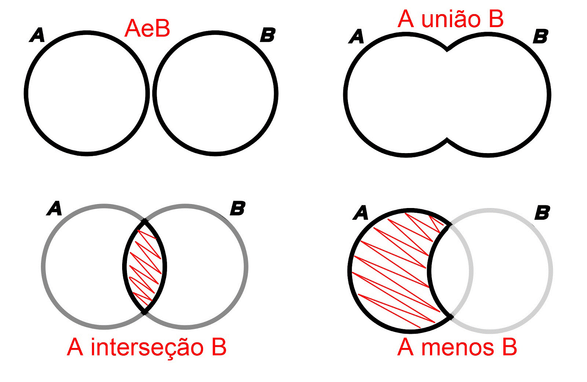
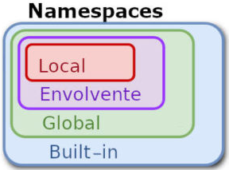
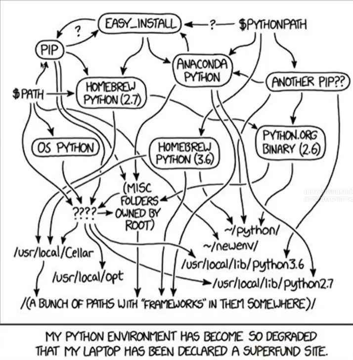
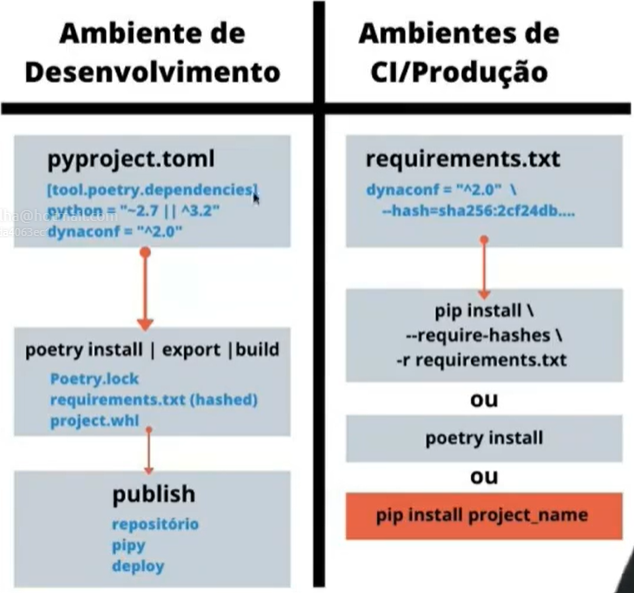
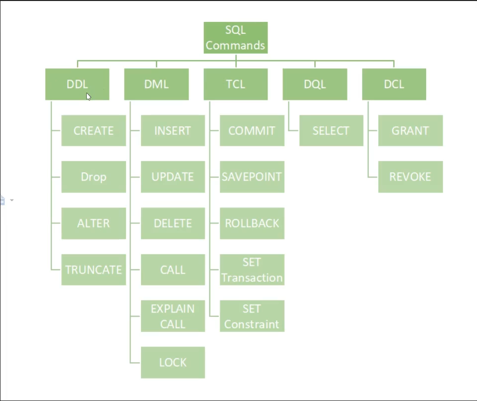

# Linuxtips - Python Base

## Dia 1 - Introdução a programação e ao Python

### Linguagens de Programação

- **Input** -> entrada, envia dados/instruções para a unidade computacional, exemplo: teclado.
- **Output** -> saída, maneira como a informação é disponibiliza, exemplo: monitor.

O computador por ser um dispositivo eletrônico, só entende a linguagem binária (0 e 1).

- 0 significa desligado.
- 1 significa ligado.

Padronização de como as informações são enviadas, feita através dos bits, cada bit representa 0 ou 1. Existindo uma sequência de 8 bits (byte), 16 bits...

Cada byte possui uma "mensagem", exigindo um cálculo na base 2, binária, chegando num número final.

- 10011011 = 155
- Letra "A" = 65 = 1000001

Linguagem de programação é uma abstração, ao olho humano é mais fácil de escrever, tendo um entendimendo melhor. No final o código é convertido para a base binária.

- **Linguagem de baixo nível** -> Assembly
- **Linguagem de médio nível** -> C, é convertida para uma linguagem de baixo nível.
- **Linguagem de alto nível** -> Python, contertida para a linguagem de médio nível.
  - **Linguagens compiladas** -> escreve o programa, e o programa precisa estar todo correto do ínicio ao fim, em pacote, o erro vai ser detectado na execução do programa já compilado.
  - **Linguagens interpretadas** -> significa que cada comando(linha) pode ser interpretado individualmente. O Python é interpretado.

No compilado se tiver um erro em qualquer lugar do código, a compilação vai falhar, e no interpretado uma linha pode funcionar e depois pode ocorrer um erro, por exemplo, no final do programa.

No código compilado, para cada sistema operacional, necessitará de um programa compilado separadamente, enquanto que o interpretado é multiplataforma, podendo o mesmo programa ser executado em diferentes sistemas operacionais.

### Como está organizada a plataforma Python

Componentes da Plataforma Python

Python é um conjunto de coisas.

- **PLR Python Language Reference** -> toda especificação, um documento de design formal da linguagem Python. A partir desse documento é possível criar uma implementação de um programa.

Implementações Python

- **IronPython** -> Python rodando no .NET.
- **Jython** -> Python rodando na Máquina Virtual do Java
- **PyPy** -> implementação do Python reescrito em Python para ficar mais rápido.
- **Stackless** Python -> galho do CPython que suporta multi-threading.
- **MicroPython** -> Python reduzido, rodando em micro controladores, dispositivos embarcados.

**CPython** -> implementação oficial. Escrito usando a Linguagem C

O CPython possui um ecossistema em torno dele, tudo em torno da linguagem Python.

- Comunidades
- PSF -> Python Software Foundation, fundacão que protege a marca Python e possui um código de conduta, também há empresas que se afiliam a fundação.
- APyB -> Fundação Python Brasil.
- Pacotes e ferramentas -> programas Pythons que podem ser reutilizados. E ferramentas para instalar bibliotecas, etc.
- PyPI -> Python Package Index.

### Instalação do Python e preparação do ambiente

- Replit
- Gitpod
- Micro
- Terminator

Comandos Python a partir do terminal

- `python -c "1"` -> não retorna nada, pois não foi instruído como utilizar o número 1, ele entende mas ele não sabe o que fazer, é um valor literal.
- `python -c "print(1)"` -> ele imprime o número 1, pois o interpretador foi instruído a fazer essa ação.
- `python -c "print('giovanni'.upper())"` -> imprime "GIOVANNI" pois a função `upper()` coloca todos os caracteres em maiúsculo.
- `python -m site` -> executa um módulo do Python já pré-definido. Mostra como o Python que está sendo utilizado que está instalado.
- `python -m turtledemo` -> interface gráfica feita em tk com exemplos de jogos e animações
- `python -V` -> mostra a versão do Python.
- `python -VV` -> mostra a versão e a data da última compilação do Python.
- `python --help` -> ajuda do Python.
- `python` -> terminal interativo do Python, é o interpretador padrão. Sempre mostra o output.

<hr>

- **REPL** -> Read Eval Print Loop.

### Introdução ao git e seu primeiro script Python

- **Script** -> é um arquivo de comandos encadeados independente.
- **Sintaxe** -> ordem e regras que as palavras e os comandos devem ser escritos.

**Comentários** -> são ignorados pelo interpretador. Alguns comentários colocados na frente do código podem ser interpretados por algumas ferramentas.

- **Shebang** -> característica do sistema Unix/Linux, é um comentário especial, sempre presente na primeira linha do script, ele serve para identificar qual é o interpretador e a versão do Python que vai ser usada para executar o script.
  - `which python` -> caminho do Python

Um ambiente é um "local" que está preparado para executar o script ou programa Python, que possui acesso ao interpretador e ele tem acesso a informações específicas do ambiente/sistema.

Um ambiente é formado de um shell e as variáveis de ambiente, a maioria dos programas são desenvolvidos orientados a ambiente.

Ao utilizar o SHEBANG apontando para o ambiente, todas as variáveis de ambiente serão fornecidas para o Python. Ao especificar o Python no SHEBANG não será necessário especificar o Python ao executar, pode escrever apenas `./arquivo.py`.

A biblioteca `os` implementa uma função `environ()`, o environ é um Dict Like Object, que não é um dicionário puro, mas implementa seus protocolos e métodos públicos.

### Criando um programa que lê variáveis de ambiente

- É recomendável seguir um guia de estilo para escrever códigos Python. O pep8.
- Para terminal é legal manter 80 colunas de caracteres por linha. Utilizar apenas até a coluna 79, quebrando para a linha de baixo.
- Também é necessário colocar no script/programa são os metadados, que são informações que necessariamente não fazem parte do programa, mas podem serem usadas para informações adicionais. Normalmente são adicionais após o comentário de bloco de explicação do script no início do programa.

`__` -> underline duplos podem ser chamado de Dunder.

O Python executa todo o conteúdo do arquivo mesmo não estando dentro de uma função `main()`.

- Usar snake case ao escrever nomes de variáveis, mas também existe o padrão Pascal Case.
- **Built-in** -> funções, bibliotecas ou ferramentas já implementadas no Python.
- **Biblioteca padrão** -> não está incluso no Python, precisa ser importada, mas já instalada junto com o pacote do Python.

**Fatiamento** -> forma de cortar um texto, exemplo: `string[:5]`, no exemplo, só é retornada os 5 primeiros caracteres da string.

Existe outra maneira de cortar uma string, quebrando a string a partir de um caractere, usando a função `split(caractere)`.

- `unset variavel` -> apaga uma variável de ambiente.
- `export variavel` -> altera o valor de uma variável de ambiente.
- `LANG=pt_BR python3 hello.py` -> exporta uma variável de ambiente diretamente ao executar um script Python, sobrescrevendo o valor padrão do sistema operacional.

### Tipos de Instruções: Expressions, Statements, Assignment

- **Expressão/Expression** -> instrução que espera um valor de retorno. Ex: `1+1`.
- **Declaração/Statement** -> instrução que prepara o interpretador para uma determinada tarefa mas não retorna valor. Ex: `if, else, def, for`.
- **Atribuição/Assignment** -> instrução que pega o retorno de uma expressão e processa o seu valor com intuito de armazenar. Ex: `soma = 40 + 2, soma += 3, soma -= 3`.

**Protocolos** -> o que o objeto é capaz de fazer.

O interpretador executa a linha sempre da esquerda para direita.

Precedência de operadores aritméticos (PEMDAS)

1. Parênteses.
2. Exponenciação e Raízes.
3. Multiplicação
4. Divisão.
5. Adição.
6. Subtração.

Precedência de operadores do Python

- 7(alto): exponenciação `**`.
- 6: multiplicação `*`.
- 5: adição `+,-`.
- 4: relacional `==,!=,<=,>=,>,<`.
- 3: lógico `not`.
- 2: lógico `and`.
- 1(baixo): lógico `or`.

### Blocos de código e identação

- Python não usa chaves para delimitar os blocos de código, ele usa 4 espaços em branco de identação(recuo) obrigatório.
- Os dois pontos (:) indica que a partir começa um bloco de código.
- Existem blocos condicionais e blocos de repetição.
- Para cada bloco de código aninhado, soma-se 4 espaços em branco, aumentando o recuo.
- É recomendável não passar de 3 a 4 níveis de identação.

### Ambientes virtuais e a ferramenta iPython

- O ambiente é aonde o programa/script vai ser executado.
- Para garantir que o programa/script rode corretamente e igualmente em todos os computadores se faz necessário a criação de um ambiente virtual.

É uma boa prática é criar um ambiente virtual do Python para todo projeto, evitando que danifique o sistema operacional, por conta de conflitos, separando todo o ambiente do projeto do ambiente real do computador.

- `python3 -m venv nome_do_ambiente` -> comando para criar um ambiente virtual utilizando a versão 3 do Python, uma conversão para nome de um ambiente é `.venv`, pois arquivos/pastas que utilizam "." antes do nome normalmente são ocultos e não aparecem no sistema de arquivo do SO.
- `source .venv/bin/activate` -> comando para ativar o ambiente virtual no Linux.

Não há necessidade de mandar a pasta do ambiente virtual para o repositório git.

- `python3 -m pip` -> módulo do Python destinado a instalação de pacotes.
- `python3 -m pip install ipython` -> instala a biblioteca iPython, um interpretador interativo melhorado de Python.
- `python3 -m pip install --upgrade pip` -> atualiza o pip para a última versão, recomendado sempre executar ao criar um novo ambiente virtual.

Ao usar `%time` no iPython antes de qualquer código, é mostrado o tempo de execução utilizado, além dos recursos computacionais.

## Dia 2 - Tipos de Dados e Protocolos

### A importância dos tipos de dados e o tipo inteiro

- Ao realizar uma operação de atribuição, o interpretador do Python realiza uma operação de inferência de tipo, para saber a maneira e o local correto de armazenar a informação na memória.

Tipo de dado também pode ser chamado de classe de dado ou categoria de dado.

O interpretador do Python converte um número inteiro para uma sequência de bits para armazená-los na memória.

- `bin(numero_inteiro)` -> retorna o valor em binário de qualquer número inteiro. Tudo que começa com `0b` no Python indica um número binário.

Na memória do computador, o identificador(nome da variável) está apontando para uma sequência de bits. Ao solicitar um dado da memória, o Python o converte para o contexto da aplicação, isso é realizado através do tipo de dado.

No caso de letras ou strings, cada letra é convertida para um número inteiro, depois converte novamente para binário e então é armazenado o valor binário na memória.

**Exemplo**

Como é realizado o armazenamento da operação de atribuição `numero = 65`.

- Em seguida, o interpretador vai identificar, através da inferência de tipos, qual o tipo daquele dado, neste caso, um inteiro(int).
- Depois, o interpretador cria um "envelope" e atribui a um espaço na memória RAM, numa posição qualquer.
- E dentro desse "envelope" o Python armazena o número inteiro "65" convertido para binário, que é "1000001".
- Finaliza colocando nesse "envelope" uma etiqueta contendo o nome da variável em questão, no caso "numero".

Ao solicitar essa variável `numero`, o interpretador Python vai buscar na memória o local que possui o identificador "numero" e ao ver que aquele valor é do tipo inteiro, o interpretador vai converter o número binário para um número inteiro e por fim, exibir na tela(output).

<hr>

- `id(variavel)` -> retorna o número, que é a posição em que se encontra aquela variável na memória RAM. Esses valores são aleatórios e não sequenciais.
- `type(variavel)` -> retorna qual o tipo do valor armazenado em uma variável qualquer.

Um objeto é um conjunto composto por um endereço de memória, um tipo, um valor e um identificador(nome da variável). Todo objeto possui as mesmas características.

Dado é o valor armazenado na memória, e é através do tipo de dado que esse dado é transformado em uma informação para ser compreendida.

Os tipos de dados são divididos em duas categorias: primários e compostos

#### Tipos de dados primários(Scalar Types)

- São tipos de dados que servem para representar apenas um único valor.

Um desses tipos de dado é o Tipo Inteiro(Integer), que é uma classe definida no código fonte do Python que juntamente do valor traz todo o comportamento específico dessa classe.

Não é necessário explicitamente dizer ao Python qual o tipo de objeto a guardar na memória, pois o interpretador faz isso dinamicamente.

- `int(valor)` -> força o tipo de um determinado valor para inteiro.
- `dir(tipo_de_dado)` -> retorna uma lista contendo todos os métodos e protocolos de um determinado tipo de dado, eles determinam quais operações que aquele objeto pode realizar.

**Métodos públicos**

- Qualquer método que não possui dunder, são chamados de métodos públicos.

**Protocolos**

- Já os protocolos(métodos que possuem dunder), determinam as operações e ações que o tipo de dado pode realizar, normalmente, não são utilizados. Tudo no Python vai funcionar através desses protocolos, que são vários.
- Existem protocolos que exigem apenas um método dunder, enquanto há protocolos que exigem mais de um método dunder para funcionar.

**Exemplos**

***Método Dunder Add***

Quando um objeto implementa o método `__add__()`, ele implementa o protocolo addible, significa que o objeto é capaz de receber adição de outros números.

- `numero + 1` = `numero.__add__(1)`

***Método Dunder Eq***

Implementa o método `__eq__()`, que implementa o protocolo equal, significa que o objeto pode realizar operações de comparações.

- `numero == 65` = `numero.__eq__(65)`

### Tipos Float, Bool, NoneType

Os tipos Float, Bool, NoneType são tipos primitivos.

**Tipo Float**

- É um número que além do número inteiro, possui uma parte fracionada, Float de ponto flutuante. Representa frações.
- É a presença de um ponto no número que faz com o Python trate como Float.
- Podem ser negativos ou positivos.

```python
valor = 2.0
type(valor) # float
valor.is_integer() # true

valor = 2
type(valor) # int
```

- Para representar valores monetários, o ideal é utilizar o tipo Decimal (ou Currency). Pois a precisão do tipo Decimal é maior do que a do tipo Float.

**Tipo Boolean**

- Pode ter apenas o valor True (Verdade) ou o valor False (Falso).
- Representado pelo nome `bool`.
- O número 0 é igual a False e o número 1 é igual a True.
- Expressões lógicas sempre retornam um booleano.
- O `if` só funciona com valores booleanos.
- Texto vazio é considerado como o valor 0 (False).
- Para o interpretador do Python todo valor numérico, diferente de 0, é True.

**Tipo NoneType**

- Apenas possui uma opção de valor, `None`, que significa nulo ou ausência de valor.
- No Python, todo objeto (variável) deve ser inicializado, sempre contendo um valor.
- Pode ser usado para inicializar uma variável que ainda não se sabe o valor, posteriormente, essa variável pode ter seu valor mudado.

**Singleton** -> objetos que podem ser criados uma única vez durante toda a execução do código.

Toda variável None terá a mesma posição na memória, independente da quantidade de variáveis com o valor `None` atribuído.

- Em alguns casos, funções irão retornar um valor `None`. Isso ocorre pois toda função, por ser uma expressão, deve retornar um valor.

### Textos, Caracteres, Encoding e Strings

- Tipos de dados que fica entre os tipos primário e os tipos compostos.

**String**

- Representa uma cadeia de caracteres.
- Objeto representado pela classe `str`.
- Criado usando aspas duplas ou aspas simples.

Textos com mais de um caractere são chamados de Bytearrays ou String. Cada caractere no texto é convertido para um byte e armazenado na memória, formando uma cadeia de bytes.

**Tabela ASCII**

- O interpretador do Python usa uma tabela padrão ASCII para converter um número inteiro em um caractere específico.
- Limitada, pois só possui os caracteres americanos.
- Por limitação de memória possui apenas 127 valores (caracteres).
- Os primeiros 33 caracteres são chamados de caracteres de controle.

**Tabela Unicode**

- Uma tabela única extendida que possuem muitos caracteres, além de emojis. Melhoria da Tabela ASCII.
- O interpretador do Python já converte automaticamente qualquer valor hexadecimal da Tabela Unicode ao usar a função `print()`.
- É um consórcio mundial de várias empresas.

**UTF-8**

- Tabela Unicode que em cada posição consegue armazenar 8 bits.
- Existem alguns caracteres da Tabela Unicode que ocupam mais de 8 bits.

**Serialização**

Conversão de um objeto Unicode em uma representação em texto em hexadecimal. Ideal utilizar para trafegar pela rede ou armazenar caracteres Unicode em servidores ou banco de dados que não suportam Unicode.

- `variavel.encode("utf-8")` -> converte para uma string que tem uma sequência hexadecimal que representa um caractere especial da Unicode.
- `variavel.decode("utf-8")` -> converte da sequência hexadecimal para o caractere especial da Unicode.
- `bytes(variavel, "utf-8")` -> retorna a representação em bytes do valor de uma variável, o segundo parâmetro informa qual a tabela que o interpretador vai utilizar para buscar esses valores.
- `string[numero]` -> fatiamento, fatia a string em várias formas. Também é possivel selecionar um intervalo de caracteres da string, usando `[inicio:fim]`.
- `len(variavel)` -> retorna o número de itens dentro de um objeto que pode armazenar outros objetos, pode ser usado em uma string para retornar a quantidade de caracteres.

É possível concatenar apenas textos usando o caractere `+`, exemplo: `"Giovanni" + "Padilha"`.

Também é possível multiplicar textos, `"Giovanni" * 2` = `"GiovanniGiovanni"`.

Strings são percorríveis, podendo percorrer cada caractere como se a string fosse uma lista contendo caracteres.

- `next(variavel_iteravel)` -> retorna o próximo objeto de um objeto iterável.
- `string.upper()` -> retorna toda a string em maiúsculo.
- `string.lower()` -> retorna toda a string em minúsculo.
- `string.capitalize()` -> coloca a primeira letra da primeira palavra da string em maiúsculo.
- `string.title()` -> coloca a primeira letra de todas as palavras da string em maiúsculo.
- `string.split(caractere)` -> separa a string em uma lista, cortando com base em um caractere especificado.
- `string.startswith(caractere)` -> verifica se a string começa com o caractere especificado, retornando True ou False.

Esses métodos podem ser usados em cadeia. Por exemplo: `string.upper().split()`.

Strings podem ser comparadas, de acordo com o valor daquele caractere na tabela Unicode ou ASCII.

- `sorted(string)` -> retorna uma lista de caracteres em ordem alfabética.
- `reversed(string)` -> retorna um objeto do tipo reversed (pode ser convertido para uma lista) com os caracteres começando do fim.

Os dois métodos acima apenas funcionam pois o objeto `str` implementa o protocolo dunder `__eq__`.

As strings estão entre os objetos primários e compostos pois, uma string armazena semânticamente um único valor, porém internamente, o Python grava uma sequência de caracteres a partir dessa string.

### Formatação de Textos

#### Concatenação

- É possível concatenar várias strings, ex: `'Giovanni' + 'Padilha' = 'Giovanni Padilha'`.
- O operador `+` apenas concatena string com string, para concatenar outros tipos de dados com strigs se utiliza o operador `,`, ou então converter a variável para string usando `str()`. Isso ocorre pois o Python é de tipagem forte.

#### Interpolação

- Define a mensagem (string) antes, criando um template.
- Nesse template, terá os placeholders que é o local que vai ser substituído na string por um valor de uma variável. Esses placeholders são definidos usando o operador de `%` seguido de uma letra, ex: `%s`.
  - `%s` indica um placeholder para strings.
  - `%d` indica um placeholder para integers. Para indicar a quantidade de dígitos `%03d`.
  - `%f` indica um placeholder para floats. Para indicar quantas casas decimais mostrar `%.2f`.

Para substituir esses placeholders por valores de variáveis utiliza: `template % (variavel_1, variavel_2, ...)`.

Útil para usar na biblioteca `logging`.

**Parâmetros Nomeados**

- Atribui um nome para o placeholder, usado em textos muito grande.
- Sintaxe: `%(nome)s`

Para atribuir valores a esses placeholders se usa um dicionário `template % {'nome':'Giovanni', chave: valor, ...}`.

#### String Format

- Método `str.format()`.
- New style, forma mais recente de formatar textos no Python3.
- Em vez de utilizar `%`, utiliza `{}`.
- Para formatar segue o mesmo padrão da Interpolação, a diferença é que vem `:` antes da especificação.

Útil para mensagens longas, como e-mails.

*Exemplo*

```python
msg = "Olá, {} você é o player n {:03d} e você tem {:.2f} pontos"

msg.format("Giovanni", 2, 987.3)
```

**Extras**

- Centraliza textos `{:^10}.format("Giovanni")`, o número 10 é o tamanho do espaço, centraliza em 10 caracteres.
- Alinha a esquerda `{:<10}.format("Giovanni")`.
- Alinha a direita `{:>10}.format("Giovanni")`.
- Preenche os espaços em branco com um caractere especificado `{:#^10}.format("Giovanni")`, preenche com `#`.
- Corta uma string `{:^10.3}.format("Giovanni")`, usando em valores floats imprime uma representação abreviada.

**Chaves Nomeadas**

- Atribui nome as chaves, ex: `{pontos:.2f}`.

Substituindo os placeholders nomeados `str.format(nome_variavel=valor, ...)`

#### f-strings

- A partir do Python3, nova sintaxe de aplicar `str.format`.
- Sintaxe simplificada: `f"Olá, {nome}"`
- Obrigatório aplicar um nome para os placeholders. E cade placeholder se refere a uma variável existente, se não existir a variável, retorna erro.

Uso geral, qualquer tipo de mensagem.

#### Emojis

Há duas formas de imprimir emojis no Python.

- A primeira forma é através do código unicode do emoji. Utiliza `\U000` antes do código do emoji.
- A segunda forma é substituir o `\U` pelo nome do emoji usando `\N{nome_emoji}`.

### Tipos de Dados Compostos e Tuplas

- Capaz de armazenar (como um contâiner) mais de um único valor, até mesmo diferentes tipos de dados.

#### Sequência

- Um único objeto na memória, que possui um nome.
- Dentro desse objeto sequência, terá posições que vão referenciar aos objetos contidos dentro desse contâiner. Cada objeto dentro de um contâiner vai ser armazenado na memória separadamente, da mesma forma que uma variável individual, tendo sua posição, tipo de dado e valor.

#### Tuplas (Tuple)

- Cria uma sequência de objetos heterogêneos.
- Cada objeto é separado por vírgulo, e os objetos como um todo são armazenados dentro de uma Tupla.

<hr>

- `tuple.count(valor)` -> retorna a quantidade de vezes que um determinado valor é encontrado dentro de uma Tupla.

A Tupla pode ser subscrita, ex: acessando o último valor da tupla `tuple[-1]`. As Tuplas são acessados pelo índice, começando por 0, ao usar índices negativos o acesso é feito do inverso. É o fatiamento, ex: `tuple[indice_inicial:indice_final]`

- Também pode ser iterada.
- É opcional o uso de parênteses ao realizar a atribuição, apenas as vírgulas são obrigatórios, é a partir delas que vai ser inferido o tipo de dado Tuple.
- A Tupla é imutável, a partir de sua criação, ela não pode ser alterada.

**Desempacotamento de Tupla**

- Desempacota uma Tupla em várias variáveis separadas, ao mesmo tempo.

*Ex:*

```python
pontos = 2, 1, 99

x, y, z = pontos

# x = 2
# y = 1
# z = 99
```

- Para ignorar valores, basta usar o operador `*_` no local da variável em questão.
- Também podem ser desempacotados o primeiro valor e o último elemento, ex: `primeiro, *_, ultimo = valores`.
- `len(objeto)` -> retorna o tamanho apenas de sequências materializadas.

### Listas

- Objeto "padrão" no Python para sequências.
- Podem ser comparadas com arrays ou vetores, com diferenças!
- Uma lista é declarada usando `[]` (preferível) ou `list()`.
- Pode ser criada vazia, pois é um objeto mutável, pode ser alterada após ser criada.
- Todas as operações com Tuplas também é possível fazer com uma Lista.
- É permitido somar Listas uma com a outra. E o resultado dessa soma é uma outra Lista com a junção dos objetos das duas Listas.

<hr>

- `list.append(valor)` -> adiciona um objeto ao final de uma lista.
- `list.insert(posicao, valor)` -> adiciona um objeto em uma posição (índice) específico.
- `list.remove(valor)` -> remove o primeiro valor encontrado na lista, mesmo que haja dois valores iguais.
- `list.extend(list)` -> extende uma Lista com outra Lista, sem criar um objeto novo. Funciona igual com o operador `+=`.
- `list.count(valor)` -> retorna quantas vezes aparece um valor dentro de uma lista.
- `list.pop()` -> remove o último valor da lista.

Possível usar `in` em Listas, retornando True se achar ou False se não encontrar, ex: `valor in list`. Em alguns objetos ele é lento!

### Exercícios com Listas, Tuplas, Loops e Condicionais

Exercício para imprimir um relatório de quais crianças das salas 1 e 2 frequentam as atividades de inglês, música e dança separadamente.

Para esse exercício foi criado o script `my_escola_com_listas.py` localizado na pasta `exercises` do Dia 2, que utiliza dos conceitos de listas e tuplas para resolver esse problema.

### Sets e a Teoria dos Conjuntos

- Sets (Conjuntos), um conjunto não ordenado de valores únicos.
- Para criar um conjunto se usa `{}`, porém é confundida com o Dicionário que também usam chaves para delimitar. A melhor maneira de criar então é usar `set()`.
- Dentro da função `set()` você passa qualquer objeto iterável, seja uma Tupla ou Lista.
- Ao criar um Set a partir de uma String, ele cria uma sequência de caracteres únicos não ordenados. Remove itens duplicados de uma coleção.
- Não são indicados para armazenar valores, são objetos de transição, geralmente usados para operações.

Não usar Sets quando se precisa ter valores repetidos e também de manter a ordem de uma sequência ao alterá-la.

- Não possui o protocolo Subscriptable, não podendo usar índices para acessar os elementos.

#### Implementa o Diagrama de Venn e a Teoria dos Conjuntos



**Conjuntos de exemplo**

```python
conjunto_a = set([1, 2, 3, 4, 5])
conjunto_b = set([4, 5, 6, 7, 8])
```

- Podem ser convertidos diretamente ao realizar a operação usando `set()` ou criá-los já como Sets.
- Internamente, as funções `union(), intersection(), difference() e symmetric_difference()` também convertem o objeto iterável passado para um Set.

**União**

- Retorna todos os valores unidos de ambos os conjuntos. Não repete os valores.

```python
conjunto_a | conjunto_b

# ou

conjunto_a.union(conjunto_b)

# {1, 2, 3, 4, 5, 6, 7, 8}
```

**Intersecção**

- Retorna todos os valores que aparecem nos dois Sets.

```python
conjunto_a & conjunto_b

# ou

conjunto_a.intersection(conjunto_b)

# {4, 5}
```

**Diferença**

- Retorna os elementos que aparecem no conjunto A e não aparecem no conjunto B, ou vice-versa.

```python
conjunto_a - conjunto_b

# ou

conjunto_a.difference(conjunto_b)

# {1, 2, 3}

conjunto_b.difference(conjunto_a)

# {6, 7, 8}
```

**Diferença Simétrica**

- Retorna todos os elementos que estão apenas no conjunto A e apenas no conjunto B.

```python
conjunto_a ^ conjunto_b

# ou

conjunto_a.symmetric_difference(conjunto_b)

# {1, 2, 3, 6, 7, 8}
```

- `set.add(valor)` -> adiciona um novo elemento ao Set. Sempre garantindo elementos únicos.

#### Implementa Hash Table

- Resolve a complexidade algorítmica ao realizar busca dentro de uma coleção.
- Quando uma busca precisa iterar sobre todos os valores de uma coleção, a complexidade dessa busca é O(n) Big O. Este é o caso do protocolo Contains `in` das Listas e Tuplas.

No caso de buscas usando Sets, a operação de busca é de complexidade O(1) ou constante, pois ele possui uma Hash Table, onde cada elemento possui um hash único que aponta para a posição de cada objeto na memória.

### Dicionários

- É um super tipo de dado, características parecidas com a "união" do Set com a Lista.
- Implementa Hash Table e permite ser iterado.
- O Dicionário guarda duas informações para cada posição. Cada posição tem uma chave, que aponta para um valor.
- Não precisa de um índice para buscar por um valor, através da chave é possível saber aonde se encontra tal dado, independente da posição.
- As buscas para valores de chaves no Dicionário é de complexidade O(1). Agora as buscas por valores vão ter menos performance, será necessário criar um algoritmo de busca de árvore invertida.

Sintaxe para criar `{chave:valor}` ou `dict()`

- A chave e o valor podem ser todo tipo de objeto compatível com Hash Table.
- Não permitem chaves duplicadas.
- São mutáveis.

<hr>

- `dict[key] = value` -> adiciona um novo conjunto de chave/valor no dicionário. Também é usado para alterar um campo.
- `del dict[key]` -> remove um campo do dicionário através da chave.
- `dict[key]` -> acessa o valor a partir de uma chave.
- `dict.keys()` -> retorna uma lista contendo apenas as chaves.
- `dict.values()` -> retorna uma lista contendo apenas os valores.
- `dict.items()` -> retorna todos os campos chave e valor como Tuplas.
- `dict.update(another_dict)` -> junta um dicionário em outro. Também é possível juntar dois dicionários em um novo usando desempacotamento `{**dict_1, **dict_2}`.

Um único `*` desempacota sequências que contém um único elemento em cada posiçao, enquanto dois `**` desempacota dois elementos para cada posição, usado em Dicionários.

- `dict.get(key)` -> busca uma chave no dicionário, se não existir não retorna nada, se existir retorna o seu valor. Não gera erro se não encontrar a chave.

### Refatorando o Hello World usando Dicionários

Aula onde é refatorado o script `hello.py` localizado na pasta `day1`.

Nessa aula adicionamos o conceito de dicionários para melhorar a lógica empregada no script.

## Dia 3 - Input-Output, Algoritmos, Condicionais, Repetições

### Standard Input & Output e argumentos do CLI

Botão Ligar -> Sinal elétrico para Bios (liga o computador e inicializa os componentes iniciais), possui um SO imbutido -> CPU, inicia o processo de boot -> SSD, identifica o SO -> RAM, carrega o SO -> **stdout** (Standard Input), imprime informações na tela.

#### stdout

**stdout** -> saída padrão do computador, é um módulo virtual do sistema. Pode ter um ou vários monitores conectados a esse módulo, ou até mesmo vários terminais. Cada programa possui um Shell e possui sua saída padrão (stdout).

- O ambiente de execução do Python é acessado atráves de uma biblioteca chamada `sys` do Python, podendo acessar o stdout.
- stdout é um objeto TextIOWrapper. Espera receber texto, um descritor de arquivos. Possuindo um modo de escrita e um encoding.
- stdout varia de acordo com o programa. O stdout do iPython é o terminal.
- A função print implementa o `sys.stdout`, é uma abstração da interface stdout.
- Está no modo de escrita "write".

<hr>

- `sys.stdout.write(text)` -> imprime uma mensagem no stdout junto de um número inteiro, que é o tamanho desse texto.
- `print("text", file=open("path", "mode"))` -> substitui o stdout por um outro descritador de arquivo, em vez de imprimir no terminal, a mensagem do print vai ser gravado no arquivo.
- `open("path", "mode")` -> cria um novo arquivo em um modo especificado.

#### stdin

- Coleta informações a partir de uma interface stdin.
- Também é um descritor de arquivos e é acessado pela biblioteca `sys`.
- Está no modo de leitura "read".
- A função `input()` é a abstração do stdin, está preparado para receber a tecla Enter.

<hr>

- `sys.stdin.read(char_length)` -> espera ler um caractere, informando a quantidade esperada de caractere.
- `input("question")` -> abstração do stdin. Utilizado para programas que tenham interação humana. Também pode ser usado para dar uma pequena pausa do programa. Toda informação recebida por essa função está no formato de string e considera espaços em branco.
- `strip("char")` -> remove todos os espaços em branco do começo e do final de uma string. Também pode ser especificado um caractere específico a ser removido da string, do início e do fim.

**Formas de se comunicar e receber dados do ambiente**

- Variáveis de ambiente (não recomendável).
- CLI Args (recomendável).

Se o usuário não passar os CLI Args, então se usa a variável de ambiente, e se não tiver uma variável de ambiente definida, se utiliza um valor padrão.

- `sys.argv` -> retorna uma lista contendo os argumentos passados pelo CLI ao executar o script.
- `str.replace(actual_char, new_char)` -> substitui os caracteres de uma string por um novo caractere especificado.
- `str.lstrip("char")` -> retira todos os caracteres apenas no início da string a partir de um caractere especificado.
- `str.removeprefix("str")` -> a partir do Python 3.9, também remove caracteres do início da string.

### Exercício: Prefix calculator com CLI args e inputs

Exerício onde é necessário criar uma calculadora prefix com as 4 operações básicas, recebendo argumentos pelo terminal (CLI Args).

O script `my_prefixcalc.py` do exercício se encontra na pasta `exercises` do Dia 3.

### Manipulando arquivos e pastas

- Biblioteca `os` permite manipular o sistemas de arquivos do SO.

**Alguns métodos da biblioteca os**

- `os.listdir("path")` -> retorna uma lista com o conteúdo da pasta especificada no caminho dentro do método.
- `os.chdir("path")` -> navega para o caminho especificado.
- `os.mkdir("nome_pasta")` -> cria um diretório/pasta.
- `os.makedirs("nome_pasta", exist_ok=True)` -> cria um subdiretório dentro de outro sem exibir um erro.
- `os.path.join("pasta1", "pasta2", ...)` -> une e retorna o caminho de um diretório, considerando o SO em questão, usando a "\" ou "/". Sempre crie pastas e arquivos usando o caminho que esse método retorna.
- `os.curdir` -> retorna o diretório atual, o caminho relativo. Mais recomendável, pois considera outros SOs também, multiplataforma.
- `os.mknod(os.path.join(path, "nome_arquivo"))` -> cria um arquivo vazio dentro de um caminho.
- `os.path.basename(filepath)` -> retorna apenas o nome do arquivo do caminho dele.
- `os.path.exists(filepath)` -> retorna se o caminho de um arquivo existe ou não.
- `os.abspath(path)` -> retorna o caminho absoluto de uma pasta ou arquivo.

Para escrever num arquivo vazio é necessário um descritor de arquivos, um objeto capaz de ler e escrever um arquivo.

- `open(filepath, mode)` -> cria um file descriptor que permite a interação com um arquivo, por padrão, inicia no modo de leitura. O segundo parâmetro é o modo do arquivo, "r" para leitura, "w" para escrita. Arquivos no modo "w" substitui todo o conteúdo do arquivo, para não apagar todo o conteúdo do arquivo usar o modo "a" append. Cria o arquivo se não existir.
- `arquivo.read()` -> lê o conteúdo do arquivo. Consome o conteúdo do arquivo, linha por linha.
- `arquivo.readlines()` -> retorna uma lista, onde cada posição é uma linha de conteúdo do arquivo.
- `arquivo.write("text")` -> escreve algo dentro de um código. `\n` quebra linha.
- `arquivo.close()` -> fecha o arquivo, necessário sempre ao terminar de realizar as operações desejadas.
- `arquivo.seek()` -> volta no histórico de linhas consumidas do arquivo. Ou então reabra novamente o arquivo.

**Context Manager with**

- Cria um Context Manager usando `with`, um objeto especial para interagir com o arquivo em questão.
- Dentro do escopo do Context Manager o código é gerenciado pelo Gerenciador de Contextos, abrindo devidamente o arquivo, realizar as operações e depois fechar o arquivo automaticamente.
- Sempre utilizar um Gerenciador de Contexto para escrever em arquivos. Em alguns casos mais simples o `print("text", file=file_descriptor)` pode ser usado.

```python
with open(filepath, "a") as arquivo:
    # Code block
```

- `arquivo.writelines()` -> escreve várias linhas de uma única vez no arquivo.

**Biblioteca Pathlib**

- Abordagem mais orientada a objetos.
- Funciona em qualquer Sistema Operacional.
- Não tem necessidade de importar a biblioteca `os`.
- `from pathlib import Path`

<hr>

- `Path("pasta")` -> retorna um objeto que referencia a pasta em questão.
- `Path("pasta") / Path("pasta2")` -> une duas pastas.
- `path / Path("nome_arquivo")` -> cria um arquivo dentro de um caminho usando o objeto Path.
- `path / "nova_pasta"` -> cria um novo objeto que representa essa nova pasta. Para criar `(path / "nova_pasta").mkdir()`.
- `filepath.write_text("text")` -> escreve num arquivo usando o objeto Path.
- `filepath.read_text()` -> lê o conteúdo de um arquivo usando o objeto Path.

### Exercício - criando um bloco de anotações

Exercício para criar um bloco de anotações pelo terminal, onde as notas são salvas em um arquivo `.txt`. Também é possível ler as notas filtrando-as por sua tag.

O script de resolução `my_notes.py` está localizado na pasta `exercises` do Dia 3.

### Tratamentos de Erros com Exceptions

- **Traceback** -> palavra usada no Python para indicar um erro.
- Evitar mostrar Tracebacks para o usuário, pois expõem informações sensíveis do programa.

**Duas abordagens para tratar erros**

#### LBYL (Look Before You Leap)

Antes de tentar fazer uma operação, primeiro verifica se é possível realizar essa operação. 

Não é perfeita pois o tempo de execução do programa não é constante, sendo executado na mesma velocidade sempre.

- **Race Condition** -> é uma condição de um software aonde o comportamento do sistema é dependente de uma sequência ou tempo de eventos incontroláveis, levando a resultados inconsistentes ou inesperados.

**Exemplo de LBYL**

```python
import sys
import os

if os.path.exists("archives/names.txt"):
    input("...") # Race Condition
    names = open("archives/names.txt").readlines()
else:
    print("[Error] File names.txt not found.")
    sys.exit(1)

if len(names) >= 3:
    print(names[2])
else:
    print("[Error] Missing name in the list")
    sys.exit(1)
```

#### EAFP (Easy to Ask Forgiveness than Permission)

- Primeiro executa a operação, depois trata qualquer erro gerado.
- Deixa a complexidade algorítmica do programa melhor, pois teremos menos verificações.
- Usa a estrutura `try/except`.

**Bare except** -> captura qualquer exceção que ocorrer. Ruim, pois vários erros diferentes podem ocorrer. Não recomendado.

Sempre pensar nos erros individualmente!

- Dentro de um bloco `try` pode haver diversos `except`, cada um tratando um erro individual, maneira mais recomendada.
- São blocos de controle de fluxo, ajudam a tomar decisão sobre o fluxo do programa.
- Evitar fazer várias operações num bloco `try`.
- Possível capturar cada erro usando a palavra reservada `as`.
- Em um único `except` é possível capturar vários erros específicos.
- Pode ser usado um `else` também no bloco `try/except`, caso não houver nenhum erro, o bloco será executado.
- Também possui o `finally`, que sempre executa o bloco de código, independente se tiver ou não um erro.

É possível estourar as próprias exceções.

- `vars(__builtins__)` -> mostra uma lista com todos os erros já inseridos no Python.

Quando não souber a categoria exata do erro, o ideal é sempre utilizar um RuntimeError, erro em tempo de execução.

**Exemplo de EAFP**

```python
try:
    names = open("archives/names.txt").readlines()
except FileNotFoundError as e:
    print(str(e))
    sys.exit(1)
```

### Gravando Logs

Armazena o histórico de execução, principalmente de erros de um programa para consulta posterior.

**stderr**

- Interface virtual para onde vão os erros de um software.
- Pode ser redirecionada para um arquivo de logs.

Em sistemas Linux, o comando `python3 logs.py &>2 logs.log` pode redirecionar o strerr de um script para um arquivo.

**Biblioteca `logging`**

- Biblioteca Python utilizada para cuidar de logs.
- Possui um objeto chamado **root logger** que é logger raiz/principal do programa que está sendo rodado.
- Independente de qual módulo usar a biblioteca `logging`, todos vão estar se comunicando com o logger principal, o **root logger**.

Não pode utilizar **f-strings** com a biblioteca `logging`, pois a mensagem vai ser montada na hora que o erro ocorrer e não quando vai ser exibida ou armazenado em um arquivo de logs. Recomendado usar `%`.

**Levels de logs**

- **50: Critical** -> utilizada para indicar um erro que afetou a aplicação como um todo, todos os usuários.
- **40: Error** -> utilizada quando o erro ocorre do lado do usuário, o erro foi causado pelo usuário ou então algo ocorreu com um usuário específico.
- **30: Warning** -> mensagens de avisos para indicar que algo foi feito errado ou uma mudança, mas não significa que seja um erro.
- **20: Info** -> informações úteis para quem usa o programa, seja usuário ou desenvolvedor.
- **10: Debug** -> mensagens de erro direcionadas a desenvolvedores.
- **0: Notset** -> não é definido, não é impresso em local algum.

Por padrão, mensagens do nível info para baixo não vão ser exibidas, apenas mensagens de warning para acima vão ser visíveis.

O Level, a formatação e o destino podem ser configurados e modificados.

Os loggers tem handlers, um handler é uma classe responsável pelo destino da aonde a mensagem de log será impressa e como será impressa.

- **Boilerplate** -> código que se repete em vários locais, basicamente código repetitivo, normalmente são códigos de configuração padrão em projetos.

### Exercício: Algoritmos

Um algoritmo é uma sequência de instruções lógicas que visam obter a solução de um problema.

**Exemplo**

Problema: Ir a padaria e comprar pão
Premissa: Padaria da esquina abre fds: até 12h, semana até 19h, feriado (exceto Natal) não abre.

1. A padaria está aberta?
   1. Se é feriado e NÃO é natal: não
   2. Senão, Se é sábado OU domingo E antes do meio dia: sim
   3. Senão, Se é dia de semana E antes das 19h: sim
   4. Senão: não
2. Se padaria está aberta E:
   1. Se está chovendo: Pegar guarda-chuvas
   2. Se está chovendo E calor: Pegar guarda-chuvas e garrafa de água
   3. Se está chovendo E frio OU negando: pegar guarda chuva, blusa e botas
   4. Ir até a padaria:
      1. Se tem pão integral E baguete: Pedir 6 de cada
      2. Senão, se tem apenas pão integral OU baguete: Pedir 12
      3. Senão: Pedir 6 de qualquer pão
3. Senão
   1. Ficar em casa e comer bolachas

**Statements do algoritmo**

- Se -> `if`
- Senão, se -> `elif (else if)`
- Senão -> `else`
- E -> `and`
- OU -> `or`
- Não -> `not` inverte o resultado de um outro statement.

**Expressions**

Retornam um valor do tipo `bool` True or False

- é feriado?
- é natal?
- é feriado e NÃO é natal
- é sábado?
- é domingo?
- é sábado OU é domingo

**Actions**

- Função -> bloco de código que realiza uma ação.
- Método -> função de dentro de um objeto.
- Instrução

Usar `is` em vez de `==` para comparar variáveis booleanas.

**Short Circuit** -> na estrutura de condicionais `if` e `elif` se uma das expressões foram verdadeiras ou falsas, as outras condicionais nem vão ser verificadas. Nesse caso o ideal é começar a partir da expressão com mais condições.

O pseudo-código encontra-se no arquivo `algoritmo.py` no Dia 3.

### Condicionais ternárias e inlines + Python Tutor

- O operador `or` é Short Circuit, caso a primeira condição da direita seja verdadeira, ele nem checa a segunda. Já o operador `and` checa obrigatoriamente todas as condições.
- O operador `is` checa se os objetos estão no mesmo lugar da memória, ou seja, são os mesmos objetos.

Listas, dicionários e strings vazias contam como um objeto Falso. O número 0 também conta como Falso.

**if ternário**

- Também é conhecido como `if inline`.
- Expressa uma condição em uma única linha de código.

*Exemplo* -> `valor = "ok" if n2 > n1 else "nok"` ou pode ser usado separadamente `"ok" if n2 > n1 else "nok"`.

Se a condição `n2 > n1` for verdadeira o valor "ok" vai ser atribuído a variável, se a condição não for verdadeira, então irá atribuir o valor "nok" a variável.

Também é possível usar o operador `or` para realizar operações inline, ex: `variavel = valor1 or valor2`. Se o `valor1` for verdadeiro, ele será atribuído a variável, se não, o `valor2` vai ser atribuído, usar com muito cuidado!

- `help("symbols")` -> mostra todos os símbolos disponíveis no Python, excluindo os símbolos `:=` e `=`.

### Repetições com for e while

#### For

- **Coleção materializada** -> coleções que o interpretador necessita armazenar na memória e atribuir um identificador para cada elemento dentro dessa coleção. Ocupa bastante espaço na memória

A função `range()` é uma alternativa melhor para listas materializadas, pois ele não armazenada cada valor da lista em um espaço separado na memória, ele ocupa apenas três espaços, o `start`, `next`, `stop` e `step`.

- `start` indica qual o valor inicial.
- `next` qual o próximo valor.
- `stop` qual o valor que ele deve parar.
- `step` de quanto em quanto ele vai pular, ex: 2 em 2

Essa função retorna um objeto iterável que ocupa muito menos espaço em memória, mais eficiente que listas.

- `continue` -> ao ser usada dentro de um loop `while` ou `for` ela faz com que o interpretador pule para a próxima iteração do loop e não executa as prõximas linhas de código.
- `break` -> ao ser usada dentro de um loop, ele faz com que o loop seja encerrado, se tiver próximas iterações não são executadas.

**Parsing** -> transformar um texto de um arquivo em um objeto Python ou qualquer outra linguagem.

**List Comprehension**

- É uma abordagem mais voltada a funcional, que evita ficar criando objetos de apoio (*side effects*) e alterando-os dentro de loops.
- Essa abordagem gera menos efeito colateral.
- Sempre cria um objeto do tipo `list`.

**Dict Comprehension**

- Mesma abordagem da List Comprehension, porém cria objetos do tipo dicionários.

Também é possível implementar `if ternário` dentro de uma List e Dict Comprehension!!!

#### While

- Repete um bloco de código enquanto uma condição for verdadeira (True).
- Dentro do bloco de código `while` é possível ter outras condições de parada.
- As palavras reservadas `continue` e `break` funcionam da mesma forma no `while`.
  - O `break` para completamente a execução do `while`.
  - O `continue` pula uma iteração e volta pro início do bloco de código.

**Dead lock** -> quando o loop não consegue sair de um `continue`, para evitar esse erro, sempre incrementar a condição antes de um `continue`.

Tomar cuidado com loops infinitos, sempre ter uma condição de parada em um loop `while`.

### Exercícios: iterações, textos, inputs, arquivos de texto

#### Exercício: Números pares

**Premissa do exercício**

Faça um programa que imprime os números pares de 1 a 200.

ex `python3 numeros_pares.py`
- 2
- 4
- 6
- 8
- ...

<hr>

A minha resolução se encontra no script `my_numeros_pares.py` na pasta `exercises` do Dia 3. A resolução do professor se encontra no script `numeros_pares.py` do Dia 3.

#### Exercício: Alerta

**Premissa do exercício**

Alarme de temperatura.

Faça um script que pergunta ao usuário qual a temperatura atual e o índice de umidade do ar
sendo que será exibida uma mensagem de alerta dependendo das condições:

- Se temp maior 45: ALERTA!!! Perigo calor extremo
- Senão, temp vezes 3 for maior ou igual a umidade: ALERTA!!! Perigo de calor úmido
- .. temp entre 10 e 30: Normal
- .. temp entre 0 e 10: Frio
- .. temp < 0: ALERTA: Frio extremo

<hr>

A minha resolução do exercício se encontra no script `my_alerta.py` dentro da pasta `exercises` do Dia 3. A resolução do professor se encontra no script `alerta.py` do Dia 3.

#### Exercício: Repete vogal

**Premissa do exercício**

Repete vogais,

Faça um programa que pede ao usuário que digite uma ou mais palavras e imprime cada uma
das palavras com suas vogais duplicadas.

ex: `python3 repete_vogal.py`

- 'Digite uma palavra (ou enter para sair):' Python
- 'Digite uma palavra (ou enter para sair):' Bruno
- 'Digite uma palavra (ou enter para sair):' `<enter>`
- Pythoon
- Bruunoo

<hr>

A minha resolução do exercício se encontra no script `my_repete_vogal.py` dentro da pasta `exercises` do Dia 3. A resolução do professor se encontra no script `repete_vogal.py` do Dia 3.

#### Exercício: Reserva de quartos

**Premissa do exercício**

Faça um programa de terminal que exibe ao usuário uma listas dos quartos
disponíveis para alugar e o preço de cada quarto, esta informação está
disponível em um arquivo de texto separado por vírgulas.

`quartos.txt`

codigo, nome, preco
- 1, Suite Master, 500
- 2, Quarto Familia, 200
- 3, Quarto Single, 100
- 4, Quarto Simples, 50

O programa pergunta ao usuário o nome, qual o número do quarto a ser reservado
e a quantidade de dias e no final exibe o valor estimado a ser pago.

O programa deve salvar esta escolha em outro arquivo contendo as reservas.

`reservas.txt`

cliente, quarto, dias
- Bruno,3,12

Se outro usuário tentar reservar o mesmo quarto o programa deve exibir uma
mensagem informando que já está reservado.

<hr>

A minha resolução do exercício se encontra no script `my_reserva.py` dentro da pasta `exercises` do Dia 3. A resolução do professor se encontra no script `reserva.py` do Dia 3.

### Exercício extra: Dica de iteração, correção de bug + sistema de reservas em hotel

- Não realizar operações dentro de uma iteração que remova ou adiciona chaves em um dicionário ou lista. Para casos que são necessários alterar um dicionário ou lista, sempre criar uma cópia do objeto a ser utilizado usando a função, pois fica armazenada em outro espaço de memória `copy()`. Num geral, nunca realizar essas operações dentro de uma iteração de objetos mutáveis!

Correções nos exercícios: Alerta e Reserva de quartos.

## Dia 4 - Funções, Debugging, Projetos e Bibliotecas

### Funções úteis embutidas no Python - builtins

- Função é um bloco de código/algoritmo que fica encapsulado dentro de um objeto. ex: `print`
- O nome da função, ex: `print` é a variável/identificador que indica aonde esse objeto está armazenado na memória, possui um id na memória.
- Toda função embutida (builtins) do Python é identificada por `buitin_function_or_method` ou `<function name>`.
- Uma função é um objeto e possui atributos.
- Normalmente o código de funções builints não são acessáveis, pois estão escritos em C.
- Funções em Python, são objetos de primeira classe, isso significa que podem serem usadas para tudo. Por exemplo, passar uma função para dentro de outra função.

<hr>

- `__code__` é um atributo que guarda o código compilado de uma função.

**Builtins**

- Embutido no Python, sem a necessidade de importar ou instalar nada.

**Stdlib**

- Biblioteca padrão que vem junto da instalação do Python, sendo necessário importar as bibliotecas antes de usá-la.

**Algumas funções úteis da biblioteca builtin**

- `sum(collection)` -> retorna a soma de uma coleção numérica.
- `max(collection)` -> retorna o maior elmento de uma coleção numérica.
- `min(collection)` -> retorna o menor elemento de uma coleção numérica.
- `len(collection)` -> retorna o tamanho de uma coleção. Alguns emojis podem ter seu tamanho maior que 1.
- `reverse(collection)` -> retorna o objeto iterator de uma lista ou tupla invertida, podendo ser convertido para uma lista ou tupla.
- `sorted(collection)` -> retorna uma nova coleção ordenados alfa numéricamente, também vale para strings.
- `all(collection)` -> retorna um booleano, True se todos os elementos da coleção são considerados True (Trufy) ou False se algum elemento for considerado False (Falsy). No caso de uma lista vazia, ele considera como True. Sempre utilizar em coleções com apenas elementos booelanos para evitar bugs de Trufy e Falsy.
- `any(collection)` retorna um booleano, se apenas um dos elementos for True (Trufy) a função retorna True, senão retorna False.
- `enumerate(collection)` -> retorna para cada valor de uma coleção o seu index e valor em um formato de tupla.
- `zip(collection1, collection2)` -> retorna uma lista de tuplas, onde a primeira tupla possui o primeiro elemento da primeira coleção junto com o primeiro elemento da segunda coleção, assim sucessivamente.

**Programação funcional**

- Usa funções como base para resolver problemas. 
- Cria menos side effects do que a programação procedural, menos variáveis de apoio e menor uso da memória.

Existem algumas funções no Python voltadas para esse tipo de paradigma de programação.

- `filter(function, collection)` -> aplica uma função (com retorno booleano) para cada objeto de uma coleção. O retorno da função `filter` retorna apenas os elementos que deram True. O resultado do filter pode ser menor que a coleção original.
- `map(function, collection)` -> aplica uma função para cada objeto de uma coleção. O retorno da função `map` retorna todos os elementos da coleção, sempre tendo um resultado do mesmo tamanho e tipo da coleção original.

### Funções úteis da standard library + envio de e-mails

- A biblioteca padrão é instalada com o Python, um conjunto de código adicional.
- `help("modules")` mostra os módulos da biblioteca padrão já instalados.

#### Módulo random

- Gera coisas aleatórias.
- `import random` importa o módulo para o script.

<hr>

- `random.random()` -> retorna um número pseudo randômico. O número gerado está entre 0.0 - 1.0.
- `random.randint(start, end)` -> retorna um número aleatório entre um intervalo de números, podendo repetir o número.
- `random.choice(collection)` -> retorna uma escolha aleatória de dentro de uma coleção, podendo ser repetida.
- `random.sample(collection, size)` -> retorna uma amostra (de um tamanho `size` escolhido) aleatória, podendo ser repetida. Não altera o objeto original.
- `random.shuffle(collection)` -> randomiza uma coleção com o seu tamanho máximo, a diferença é que ele altera a coleção original com o valor aleatório gerado.

#### Mõdulo itertools

- Novas formas de iterações para objetos iteráveis.
- `import itertools` para importar o módulo.
- Normalmente abreviado com o `as` para `it`.

<hr>

- `it.cycle(iterable)` -> retorna um objeto do tipo cycle, serve para repetir um objeto em ciclos indefinidos. Função `enumerate()` é bom para usar com essa função, pois cria uma espécie de contador.
- `it.repeat(iterable, num_of_repeats)` -> repete um objeto (uma string, por exemplo) um número de vezes (`num_of_repeats`) especificado.
- `it.accumulate(iterable)` -> retorna um objeto do tipo accumulate, soma dos elementos da coleção, cada operação de soma do objeto com o próximo ele atribui a um espaço na lista, até chegar no valor máximo. (mesmo caso da função `sum` a diferença é que retorna operação por operação de soma até chegar no valor máximo)
- `it.product(iterable, repeat)` -> retorna todos os produtos cartesianos de um objeto iterável, equivalente a loops for aninhados em uma expressão geradora. O parâmetro opcional `repeat` indica o tamanho de cada produto.
- `it.permutations(iterable)` -> retorna todas as permutações (se repetem, não são únicas) possíveis de uma sequência.
- `it.combinations(iterable, repeat)` -> retorna todas as combinações (não se repetem, são únicas) possíveis de uma sequência. O parâmetro `repeat` indica o tamanho de cada combinação.
- `it.groupby(iterable, key)` -> agrupa os elementos em um iterável com base em um valor chave, retorna um iterador de tuplas, onde cada tupla contém a chave e um iterador dos elementos que possuem essa chave. O parâmetro `key` recebe uma função.

#### Módulo functools

- Funções que manipulam outras funções.
- `import functools` importa o módulo.
- Abreviada para `ft`.

<hr>

- `myfunction = ft.partial(function, partials_params)` -> cria uma versão parcial a partir de uma função, onde é possível preencher alguns parâmetros e deixar preenchidos como padrão. Pode ser usado em métodos e funções.

#### Módulo statistics

- Módulo para estatística.
- Importado com `import statistics`.
- Abreviado como `st`.

<hr>

- `st.mean(iterable)` -> retorna a média de um objeto iterável.
- `st.median(iterable)` -> retorna a mediana de um objeto iterável.

#### Módulo uuid

- Universal Unique ID (Identidade Universal Única)
- `import uuid` para importar o módulo.

<hr>

- `uuid.uuid4` -> retorna um id único a cada vez que é executado. O algoritmo mais usado é o uuid4. O MongoDB utiliza o formato uuid4 para gerar suas chaves únicas.

#### Módulo getpass

- Módulo para mexer com senhas.
- Importado com `import getpass`

<hr>

- `getpass.getpass(str)` -> serve para ler um input "silencioso", tudo que é digitado nesse input não vai aparecer no terminal.
- `getpass.getuser()` -> coleta o usuário do ambiente, também funciona no Windows.

### Escrevendo sua primeira função - aplicando fórmula

- Uma função é uma aplicação de uma fórmula, como uma fórmula matemática.
- Uma função recebe parâmetros e através desses parâmetros o resultado de uma função é calculado. (o resultado é o contra domínio)
- Toda função em python, obrigatoriamente, possui um retorno. Por padrão, se não tiver nenhuma cláusula `return`, a função irá retornar None.
- **Solid - Single Responsibility** - uma função deve resolver apenas um único problema, apenas uma única "responsabilidade".
- Funções que não possuem retorno são chamadas de procedimentos/procedures.
- Funções que não recebem nenhum parâmetro é uma função de assinatura vazia.

Ao chamar uma função em Python, será criado um escopo próprio para ela, onde seus argumentos terão seu próprio ambiente isolado, não influenciando nas variáveis globais, que estão fora do escopo da função, mesmo que seus nomes sejam iguais. As variáveis globais também não influenciam nas variáveis de escopo local das funções.

**Obs:** para valores menores que 256, o Python tenta reproveitar os valores já criado em memória, em vez de atribuir ele para outro espaço em memória.

### Anatomia de uma função

**Por que usar funções?**

- Código mais organizado.
- Realizar composições utilizando funções.

**Toda função é formada pelos seguintes elementos**

- Definição/atribuição (`def`)
- Assinatura + type hints (tudo que tiver entre o nome da função e os dois pontos)
- Documentação/docstring (comentário multi linhas dentro da função)
- Código
- Valor de retorno

`python3 -i script.py` ou `ipython -i script.py` -> roda o script no modo interativo, executa o script todo e depois abre um terminal com todos os objetos criados no script disponíveis.

**Formas de passagem de parâmetros**

Parâmetro é a variável que não se sabe o valor e argumento é uma variável com valor definido.

- **Posicional** -> passados em ordem. Usado em funções com poucos parâmetros.
- **Nomeados** -> passados usando o nome do parâmetro, especificando sua posição, podendo ser passados fora de ordem. Usado em funções com muitos parâmetros.
- **Mista** -> utiliza tanto o posicional quanto nomeado. Os argumentos posicionais devem ser passados antes dos nomeados.
- **Usando desempacotamento** -> passando argumentos utilizando o desempacotar de uma sequência, passa no modo posicional. Ao usar um dicionário a passagem é no modo nomeado. (Usar `*` para tuplas, listas e textos e usar `**` para dicionários e hashmaps)

### Escopos e argumentos mutáveis e coringas

#### Escopos



**Namespaces**

Um namespace é um local onde se pode colocar vários "nomes".

1. Local
2. Envolvente
3. Global: módulo.
4. Built-in/prelude: já vem com o programa python, script.

- Namespaces são definidos por módulo, cada arquivo com extensão `.py` por si só já é um namespace.
- O próprio nome do arquivo é o primeiro namespace.
- A separação de escopo existe pois no Python existe a opção de criar namespaces dentro de outros namespaces.

**Módulo** -> arquivo que contém código python

- `from module import object` -> importa um objeto específico de um módulo Python.
- `import module` -> importa um módulo python, que é um script com código python, sendo ele um namespace.
- `globals()` -> retorna um dicionário/hashmap contendo todas as variáveis do escopo global do script.
- `locals()` -> retorna um dicionário/hashmap contendo todas as variáveis do escopo local de uma função.

Ao acessar uma variável em determinado escopo, o intepretador vai buscá-la no mesmo escopo em que ela foi acessada.

**Por exemplo**, se uma variável global for acessada, o Python vai buscar no escopo global.

- Variáveis com o mesmo nome em diferentes escopos são tratadas como variáveis diferentes.
- Após todo o código de um escopo for executado todas as variáveis daquele escopo são excluídas.
- Para uma função interna em outra função, o escopo envolvente dela é o escopo da função em que ela está contida.
- Se o interpretador Python não encontrar a função no escopo em que ela foi chamada ele vai buscar no escopo em que está envolvido, buscando sempre no sentido: local -> envolvente -> global -> builtin.
- Toda operação de atribuição (assignment) ou que altera um nome, o Python não irá realizar a operação para variáveis de diferentes escopos, apenas irá realizar com variáveis no mesmo escopo. Para forçar esse tipo de operação basta usar a palavra reservada `global`, pode ser usada apenas no início do escopo local.
- A palavra reservada `nonlocal` acessa o escopo envolvente de uma função interna (inner function).

#### Valores Default Imutáveis

- Valores padrão atribuídos para parâmetros na assinatura das funções, caso não seja passado um valor para aquele parâmetro ao chamar a função.

**Exemplo:** `def function(param1, param2=default_value)`

- Usar valores default com objetos imutáveis é ok, muito utilizado.

#### Valores Default Mutáveis

- Valores default para objetos mutáveis usados dentro de funções: set, dict, list.
- Para todas as chamadas, ao criar um argumento mutável default, todas as chamadas da mesma função estarão usando o mesmo objeto criado inicialmente.
- Útil para cache e acumular informações.

Para evitar esse problema usar como valor default o `None` e realizar a verificação dentro da função para então criar um objeto mutável novo toda vez que a função é executada.

#### Coringas

- Argumentos coringas são argumentos que podem receber qualquer quantidade ou tipo de objeto.
- São usados quando não se sabe a quantidade ou os tipos dos argumentos a serem recebidos pela função.
- Por conversão, é usado `*args` para definir um parâmetro como coringa. Todo e qualquer valor que for passado naquele parâmetro será empacotado em uma tupla.
- Não existe uma variável nomeada ao definir um parâmetro como coringa.
- Argumentos coringa sempre devem vir primeiro na assinatura da função.
- Ao usar `**kwargs` a função poderá ingerir todos e qualquer tipo de argumentos nomeados passados na função. Criará um dicionário.

Ao usar apenas um asterisco irá capturar apenas o valor dos argumentos (posicionais).

Ao usar dois asteriscos irá capturar tanto o valor quanto o nome dos argumentos (nomeados).

### Funções Lambda

- Uma função anônima é uma função de uso único que não fica armazenada na memória.
- Forma mais prática de criar uma função e passá-la para outras função ou para compor outros objetos.
- É definida e criada no momento em que a função ou objeto em que ela está contida for chamada ou então o objeto for criado.
- Só pode conter uma única expressão e vai retornar sempre o resultado da expressão. Tudo que retorna algo pode ser usado na função lambda.
- Nunca atribuir funções lambdas para variáveis, pois é considerado uma má prática, nesse caso, definir a função utilizando `def`.

**Sintaxe:** `lambda param1, param2, ...: expression`

- `callable(object)` -> retorna True se o objeto é possível ser chamado, ou seja, um objeto com o protocolo Callable. E False se não for um objeto possível de ser chamado. 

### Exercícios com funções, recursão, programação funcional

- **Deadlock** -> o programa fica preso em chamadas de funções, entrando num loop infinito.
- **Recursão** -> quando uma função chama ela mesma. Não pode realizar mais de 1000 chamadas em sequência.
- **Biblioteca Operator** -> biblioteca já inclusa no Python que possui os sinais matemáticos e realiza as operações matemáticas, como uma calculadora.

Resolvendo os TODOs que estavam nos arquivos `alerta.py, errors.py, logs.py e prefixcalc.py` do dia 3 e os arquivos `composicao.py` do dia 4.

### Debugging

- Técnica utilizada para descobrir aonde está um erro ou um comportamento inesperado no programa/script.
- Executa o programa de uma forma mais interativa até descobrir aonde está o bug.

#### Abordagens de debugging

1. Executar o programa usando o `-i` para entrar no modo interativo com o terminal Python. Também funciona para frameworks, ex: `django-admin shell`.
2. Usar `prints` nos pontos importantes do código para imprimir no stdout os valores que o script/programa está usando para ver aonde está o comando inesperado.
3. Usar o módulo já incluso no Python `pdb` (Python Debugger). Para executar o módulo `python3 -m pdb script.py` no terminal.

Além de poder interagir com tudo que estiver no escopo do programa/script, ele vai executar o programa linha a linha.

- `help` -> mostra os comandos disponíveis enquanto estiver dentro de uma sessão de debug.
- `l` -> (line) mostra qual a linha do código que debugger está parado. Mostrando as 5 linhas anteriores e as próximas 5 linhas do código.
- `n` -> (next) executa até o fim do bloco da função atual ou então ao retornar algo, basicamente executa todo um bloco de código. Dentro de uma função, ele executa o código do escopo local.
- `s` -> (step in) executa a linha atual, para na primeira ocasião possível (uma chamada de função ou na função atual), ao encontrar uma função, ele entra dentro do escopo da função e então o código a ser executado usando o `n` vai ser o da função, no escopo local. Basicamente, avança um nível do escopo.
- `c` -> executa o programa todo até o fim e é restartado desde o início.
- `q` -> sai do modo de debug.

**Breakpoints** -> pontos onde pode ser definido para o programa parar a execução.

Breakpoints em linhas vazias podem ser inválidos!!

- `b line_number` -> cria um breakpoint indicando qual a linha que o debugger deve parar ao usar `c`. Pode criar inúmeros breakpoints. Ao chegar na linha do breakpoint criado, o breakpoint é excluído.
- `disable breakpoint_number` -> remove um breakpoint a partir de seu número.

<hr>

- `python3 -m pdb -c "until line_number" script.py` -> executa um script no modo debugger até a linha passada, abrindo o debug interativo na linha específicada.
- `python3 -m pdb -c continue script.py` -> roda um programa/script até o momento em que uma exceção ocorre, o debugger para logo antes do erro acontecer. Se não tiver erro, ele executa o programa/script todo.

4. Inserir breakpoints no próprio código, para realizar isso, basta importar no código o módulo `pdb`. Forma mais utilizada de debugging, pois em determinados contextos não é possível alterar a forma como o programa é executado.

- `import pdb` -> importa o módulo pdb
- `pdb.set_trace()` -> define um breakpoint, o debugger vai parar na linha anterior.

Também pode ser importado e usado da seguinte forma `__import__("pdb").set_trace()`.

#### ipdb

A partir do Python 3.7, foi inserido a função `breakpoint()`, que tem o mesmo resultado, mas sintaxicamente, é mais bonito.

Existe atualmente várias bibliotecas criadas a partir do `pdb` base, uma delas é a `ipdb` que é uma biblioteca do python que junta tanto o `ipython` e o `pdb`.

- `python3 -m ipdb script.py` -> executa o `ipdb`
- `interact` -> inicia o interpretador padrão do `ipython`, ao usar o `exit` para sair do interpretador, volta para o debugger do `pdb`.

A variável de ambiente `PYTHONBREAKPOINT` define qual é o debugger padrão do Python, para substituir para o `ipdb`, usar `export PYTHONBREAKPOINT = ipdb.set_trace()`.

#### pubd e winpdb

Também existe o `pudb`, que possui uma interface gráfica e também tem o `winpdb`, que é mais recomendada para sistemas Windows.

#### rpdb

`pdb` que se conecta com um servidor remoto.

5. Usar o debugger pelo VSCode. Clicar ao esquerdo do número da linha é possível determinar um breakpoint naquela linha.

### O sistema de imports do Python

#### O sistema de módulos do Python

- Mecanismo que é ativado ao utilizar a palavra chave `import` dentro dos scripts.
- Conforme o projeto vai ficando maior e mais complexo, há a tendência de criar uma arquitetura mais bem definida, assim, criando vários módulos/arquivos e separando o código em contextos.

Para realizar essa operação, o Python vai utilizar um mecanismo de imports provido pela `importlib`.

**Exemplo**

Ao usar pela primeira vez o comando: `from email import enviar_email`

- A primeira coisa que o interpretador do Python irá realizar é procurar no sistema de arquivo pelo módulo chamado email, ou seja, o arquivo `email.py`. Para encontrar esse módulo o interpretador Python vai buscar em uma lista de diretórios, provida pelo comando `sys.path`, que irá conter todos os locais possíveis que esse módulo pode estar. 

Para verificar o `sys.path` utilizar o comando: `python3 -c "import sys; print(sys.path)"`

**Ao utilizar esse comando o Python retorna a seguinte lista:**

```python
[
  '', 
  '/usr/lib/python312.zip', 
  '/usr/lib/python3.12', 
  '/usr/lib/python3.12/lib-dynload', 
  '/home/geovannepad/Repositories/linuxtips-python-base/venv/lib/python3.12/site-packages'
]
```

- O primeiro item dessa lista, a string vazia, indica o diretório atual, ou seja, ele vai buscar o módulo no mesmo diretório em que está o script que o está importando.
- Caso ele não encontrar no diretório atual, por padrão, ele vai buscar na Standard Library.
- E caso ele não encontrar na Standard Library, ele vai buscar no User Path (local de instalação de bibliotecas para cada usuário), nesse caso, as bibliotecas instaladas passando o `-u` para o instalador.
- Por fim, caso ele não encontrar em nenhum dos locais anteriores, ele vai buscar no Sys Path, que é aonde as bibliotecas do sistema estão instaladas.

É possível reutilizar os módulos em vários projetos. **Para isso, há várias maneiras de se realizar esse processo**

1. Copiar e colar os módulos nos diretórios de cada projeto (não recomendado).
2. Comprimir os módulos dentro de um arquivo zip e colocar uma data de controle de versão, para que ao atualizar haja um controle melhor.
3. Utilizar um sistema de controle de versão, como o git (mais recomendado). Assim é possível realizar o build do pacote e depois publicar esse pacote para o repositório central do Python (PyPI). **O grupo PyPI mantém as seguintes ferramentas**
   1. setuptools -> ferramenta para criar o arquivo `setup.py` para buildar e publicar.
   2. wheel -> formato de arquivo binário, o programa final será compactado nesse formato.
   3. PyPI -> repositório dos pacotes, aonde podem ser baixados.
   4. virtualenv -> isola ambientes de desenvolvimento, evitando conflitos.
   5. pip -> ferramenta para instalação de pacotes e módulos no Python.

#### Empacotamento e Distribuição

1. **Desenvolvimento** -> quando termina o desenvolvimento do software e coloca disponível para outros instalarem.
2. **Especificação** -> para isso é necessário a criação do arquivo `setup.py`, aonde é colocado todas as especificações/metadados do pacote que vai ser distribuído.
3. **Empacotamento** -> uma vez especificado, então é usado o comando `sdist` para realizar uma distribuição simples. Ou então, o comando `bdist_wheel` para criar uma distribuição binária, que vai ser compilada para cada plataforma diferente.
4. **Upload** -> a partir desse momento, há um pacote gerado no formato e pode realizar o upload para o servidor principal de pacotes do Python, usando o setuptools ou uma ferramenta como o twine.
5. **Publicação** -> a partir do momento em que o upload é feito, o pacote fica disponível no pypi.org.

Ambientes virtuais são muito importantes nessa estrutura, pois separam as dependências de um projeto do Python do sistema e de outros projetos, evitando conflitos. Geralmente, se cria um ambiente virtual para cada projeto no sistema. Isso permite que seja possível apagar um ambiente virtual, sem prejudicar nenhum outro ambiente, seja o do Python do sistema ou de outro projeto.

- Criado o ambiente virtual de um projeto, vamos realizar a instalação de dependências e para isso, em vez de instalar uma a uma, vamos criar um arquivo chamado `requirements.txt` e colocar todas as dependências que queremos.
- Além das dependências, especificamos as versões de uma cada das dependências, seja uma versão específica ou então um intervalo de versões aceitáveis, isso se chama "Pinar" as dependências

**Exemplo de arquivo `requirements.txt`**

```txt
flask = 1.0.1
django >= 2.0
dynaconf <= 2.2.1
```

- Uma vez criado essa lista de dependências, usa-se o comando: `pip install -r requirements.txt` para instalar todas as dependências e suas versões especificadas no arquivo. 
- Depois desse momento, as dependências podem ser utilizadas usando o `import`.

#### Gestão de Dependências e seus problemas

Quando o projeto tem muitas dependências e muitas versões diferentes, a árvore de dependências pode ficar muito complexa e haverá problemas e conflitos entre dependências.

- Ao usar `--site-packages` ao criar um ambiente virtual garante que o Python tem acesso a dependências do sistema operacional.

1. **Conflitos em bibliotecas no sistema operacional**

Em alguns casos, onde é necessário instalar dependências diferentes que usam uma mesma biblioteca do sistema, porém em versões diferentes vai causar um problema de "invasão" de ambientes virtuais, onde eles não serão mais isolados, pois dependem da mesma biblioteca do sistema operacional, além de dar problemas com versões diferentes. Para evitar esse tipo de conflito vai ser necessário o uso de containers, onde todo o sistema operacional é separado um do outro. Ou então sistemas operacionais com modularidades.



- Isso ocorre caso não seja utilizado corretamente os conceitos de isolamento da virtualenv.
- Para resolver esse problema, foi criado um outro pacote chamado Dephell.

2. **Conflito de versões de dependências no mesmo ambiente virtual**

Ao instalar dependências diferentes, elas podem depender de outras bibliotecas, as vezes a mesma biblioteca, porém em versões diferentes, e ao instalar qualquer uma dessas dependências, a outra vai parar de funcionar, pois ela vai instalar a biblioteca em uma versão diferente, quebrando a outra dependência.

Ficar atento na evolução das dependências, e utilizar ferramentas como o Dependabot e o PyUp, que avisam quando as versões de bibliotecas e/ou dependências são atualizadas.

3. **Segurança**

Instalar uma dependência de um servidor não original, com scripts maliciosos.

Para resolver esse problema, utilizar o `--require-hashes` para verificar os hashes toda vez que o pip for instalar um pacote.

#### Soluções

- Para resolver esses problemas citados anteriores foi criado as PEPs, que são padronizações na linguagem Python. 
- A partir da PEP 517 e 518 foi específicado um arquivo único que vai conter todas as configurações de projeto, em vez de vários arquivos separados, vai ser criado um arquivo chamado `pyproject.toml`, além disso, esse arquivo específica um sistema de build que pode ser extendido, não ficando preso a um único sistema de build. Seguindo um padrão.

Em 2016, foi criado o pipenv, que criou um padrão antes da PEP 517 ser aceita, apresentando a especificação `Pipfile`. Após um tempo, essa ferramenta foi colocada como ferramenta recomendada, sem passar pela via formal, a PEP. Após um tempo, o pipenv deu tantos problemas.

**Porém, há várias alternativas ao pipenv**

- pip-tools
- flit
- pbr
- dephell
- conda
- poetry

##### Como resolver os problemas de gestão de dependências?

- Isolamento
- Conflitos
- Segurança

**Solução mais simples**

```shell
# Ambiente de desenvolvimento
pip install pip-tools
pip-compile --generate-hashes \ --output-file requirements.txt
```

- A ferramenta pip-tools vai gerar o hashes automaticamente e colocar as versões e o hash de cada pacote no arquivo.

```shell
# Ambiente de usuário/ci/produção
pip install --require-hashes \ -r requirements.txt
```

- No ambiente de produção, será fornecido o arquivo formatado gerado pela ferramenta pip-tools. Criando um build determinístico.
- Ela resolve apenas o problema de segurança e a questão de build determinístico.

#### Poetry

Gestor de dependências que segue as especificações da PEP 517 e 518. Recomendado para ambiente de desenvolvimento!

- Substitui os arquivos `setup.py, requirements.txt, manifest.in e Pipfile` pelo arquivo `pyproject.toml`.
- Substitui os comandos `build, sdist, twine, pip, hashes, pip-tools` pelo comando `poetry`.
- Respeita a árvore git.
- Força semantic versionsing.
- Resolve conflitos.

Inspirado no cargo do Rust

##### Onde usar o Poetry?



- No ambiente de produção não usar o Poetry, usar o arquivo `requirements.txt` com o pip, gerado pelo poetry com os hashes.

##### Comandos Poetry

- `poetry new project_name` -> cria um projeto com o Poetry como gerenciador de dependências.
- `poetry env use python_version` -> cria um ambiente virtual para o projeto especificando uma versão. Podem ser criados vários ambientes virtuais.
- `poetry shell` -> ativa o ambiente virtual criado.
- `poetry add depency_name==depency_version` -> adiciona uma dependência especificando uma versão e juntamente com a dependência, são instaladas as bibliotecas necessárias para ela funcionar. Ou usar `depency_name@latest` para instalar a última versão disponível para a versão do Python utilizada.
- `poetry install` -> atualiza os pacotes. Além de regerar o arquivo `poetry.lock` e também resolve conflitos.
- `poetry build` -> gera a distribuição simples (`tar.gz`) e a distribuição compilada (`whl`) do projeto.
- `poetry publish` -> pública o projeto no PyPI.
- `poetry export -f requirements.txt -o requirements.txt` -> gera o arquivo de requirements, com todas as dependências controladas e com seus devidos hashes. Recomendado usar antes de publicar. Usar esse formato para instalar em produção, usando o pip: `pip install --require-hashes -r requirements.txt`!
- `poetry search depency_name` -> busca na PyPI todas as bibliotecas disponíveis com aquele nome.

**Observação:** O arquivo `poetry.lock` possui toda a árvore de dependências "resolvida" do projeto com os hashes específicos de cada uma. Esse arquivo permite que ao instalar outra dependência, o Poetry consegue resolver e determinar conflitos entre dependências e versões.

Usar o git juntamente, pois ele leva em consideração a árvore do git para realizar buils.

### Projeto: Criando o repositório, organizando o projeto e configurando o VSCode

**Projeto Dundie Rewards**

Nós fomos contratados pela Dunder Mifflin, grande fabricante de papéis para desenvolver um sistema de recompensas para seus colaboradores.

Michael, o gerente da empresa quer aumentar a motivação dos funcionários oferecendo um sistema de pontos que os funcionários podem acumular de acordo com as suas metas atingidas, bonus oferecidos pelo gerente e os funcionários podem também trocar pontos entre si.

O funcionário pode uma vez a cada ano resgatar seus pontos em um cartão de crédito para gastar onde quiser.

Acordamos em contrato que o MVP (Minimum Viable Product) será uma versão para ser executada no terminal e que no futuo terá também as interfaces UI, Web e API.

Os dados dos funcionários atuais serão fornecidos em um arquivo que pode ser no formato .csv ou .json e este mesmo arquivo poderá ser usado para versões futuras. `Nome, Depto, Cargo, Email`

MVP - Terminal 0.1.0

User Stories:

Epic: Administração

- EU como ADMIN quero ser capaz de EXECUTAR O COMANDO `dundie load people.txt` para alimentar o banco de dados com as informações dos funcionários.
  - Para cada funcionário no arquivo caso ainda não exista no banco de dados deverá ser criado com a pontuação inicial de `100` para gerentes e `500` para associados, caso já exista as informações diferentes deverão ser atualizadas e a pontuação somada.
  - O sistema deve evitar entrada de associados em duplicidade, e aceitar apenas e-mails válidos.
  - O sistema deve criar uma senha ideal para cada funcionário e enviar por email.
  - Os dados deverão ser armazenados em um banco de dados SQL.

- EU como ADMIN quero ser capaz de VISUALIZAR no terminal um relatório contendo as informações dos funcionários.
  - No terminal desejo ver Nome, e-mail, saldo de pontos, data da última atualização.
  - Este relatório deverá ter a opção de ser salvo em um arquivo .txt.
  - `dundie show --filter|--sort|--limit|--output`

- EU como ADMIN quero ser capaz de atribuir pontos para um funcionário específico ou para todo um departamento.
  - `dundie add --dept|--to --value=100`

- EU como ADMIN quero que as operações de ADMIN sejam protegidas por usuário e senha.

Epic: Movimentação

- EU como FUNCIONARIO quero ser capaz de visualizar meu saldo de pontos e extrato de movimentações.
- EU como FUNCIONARIO quero ser capaz de transferir pontos para outro funcionário.
- EU como FUNCIONARIO quero que as operações sejam protegidas por senha, impedindo que outro usuário altere minha conta.

<hr>

- Epic são duas entregas grandes, que possuem outras tarefas interligadas.
- Milestones são os épicos e issues são as funcionalidades de cada milestone.
- Todo projeto deve ter um ambiente virtual próprio!

**Configurando o ambiente de desenvolvimento**

1. Criar o ambiente virtual na pasta do projeto usando `python3 -m venv .venv`. E abri-lá usando `source`.

### Projeto: Criando a estrutura de pastas, build e install do projeto

- `sys.modules` -> mostra todos os módulos importados para o ambiente virtual.

Se um módulo 1 tiver importando um módulo 2, não se deve importar para o módulo 1 o módulo 2, pois isso gera um import circular, por conta do Python ser interpretado, o interpretador vai ficar tentando importar ambos os módulos, num loop infinito. Esse erro é chama-se **Circular Import**.

- **Módulos** -> arquivos em Python que não são independentes, pois eles dependem de outro módulos, estão ligados uns aos outros e normalmente estão presente num pacote. Módulos não precisam de shebang e metadados.
  - A pasta `__pycache__` contém o cache de compilação (Bytecode) dos módulos do projeto, é um intermediário entre o código Python e o arquivo binário. Gerado toda vez que um módulo é importado. 
- **Pacote** -> pasta onde estão os módulos (arquivos Python) e contém um arquivo `__init__.py`. Também pode existir subpacotes.

A pasta raiz é o "repositório dos códigos", onde se tem informação que não é código em si, como o arquivo LICENSE ou README.

Em versões mais antigas do Python, o interpretador não conseguia identificar algumas pastas como pacotes, para evitar que isso ocorra se coloca um arquivo `__init__.py` dentro da pasta para ser considerada um pacote. No Python 3 não é mais obrigatório, porém é uma boa prática. A primeira vez que o pacote for importado o arquivo `__init__.py` sempre será executado.

Algumas ferramentas de testes usam o arquivo `__init__.py` para saber quais as pastas que são pacotes e devem ser testadas.

- **Pasta `docs`** -> contém os arquivos de documentação em markdown do projeto.
- **Pasta `project_name`** -> indica o nome do projeto e é aonde contém todos os códigos, também pode ficar dentro da pasta `src`.

**Entry Point** -> ponto de entrada do programa, quando o programa for executado, o arquivo `__main__.py` vai ser executado. Determina que o pacote é um módulo executável.

Os arquivos `__main__.py e __init__.py` são essenciais para apps de CLI.

O arquivo `setup.py` é responsável por realizar a build do programa (permite que o programa possa ser instalado) e fica na raiz do repositório, esse arquivo é um modelo antigo. Não fica dentro do programa. Existem várias formas de criar esse arquivo, são elas: setuptools, pyproject, external build tools (poetry, flit).

- `pip list` -> mostra todos os módulos instalados no ambiente virtual usado.
- `python3 setup.py build` -> realiza a build do programa.
- `pip install -e caminho` -> instala o módulo a partir de um caminho/diretório no modo editável. Ao realizar mudanças no projeto, essas mudanças refletem já no projeto instalado no ambiente virtual

### Projeto: Entry Points de CLI

Entry points são formas de entrada para o programa, ou seja, formas de executar o programa.

- Entry points do tipo de linha de comando são especificados usando `console_scripts` como chave. E seu valor deve ser o caminho para um objeto executável. Normalmente usado, uma função `main()` dentro do arquivo `__main__.py`.

**Pasta `assets`** -> pasta onde ficam os recursos externos do programa como, imagens, vídeos, arquivos etc. Também armazena os arquivos de testes.

**Módulo argparse**

Módulo da biblioteca padrão do Python que auxilia ao coletar argumentos da linha de comando do terminal.

- Para importar: `import argparse`.

### Projeto: Gestão de dependências e Makefile

#### Gestão de dependências

**`Setup.py`**

O padrão para organizar as dependências é através do arquivo `setup.py` inserindo a chave `install_requires`, que é uma lista de dependências, e adicionalmente, a chave `extras_require`, que é um dicionário que indica dependências extras do projeto.

- As dependências colocadas no argumento `install_requires` vão ser instaladas por padrão ao realizar a instalação do pacote, por meio do pip, por exemplo. Aqui são colocadas as dependências necessárias para o projeto funcionar.
- Já as dependências colocadas no argumento `extras_require` são dependências opcionais, que o usuário, ao instalar, pode optar por instalá-las ou não. Aqui são colocadas as dependências que são usadas para desenvolvê-lo, como dependências de testes e desenvolvimento. Adicionalmente, pode ser criado dependências para situações específicas, como para diferentes SOs.

Para instalar as dependências extras, roda-se o comando `pip install -e .[dev|test]`.

- `pip show lib_name` -> mostra as informações da biblioteca especificada, como as bibliotecas adicionais instaladas, para que a biblioteca em questão, funcione.

Ao realizar uma instalação padrão de uma biblioteca, sempre é usada a última versão disponível no PyPi. Para especificar uma versão específica de uma biblioteca, basta adicionar na frente do nome dela a versão, por exemplo: `ipython<=8.0.0`.

**Boas práticas:** não é recomendável "pinar" (travar a versão da biblioteca) para dependências de testes e desenvolvimento, pois é necessário saber se ao atualizar a aplicação é quebrada, para então consertar. Essa abordagem não é recomendada para as dependências de produção.

<hr>

Outra abordagem para gerenciar dependências é ter um arquivo `requirements.txt` separado para cada situação, sendo elas, ambiente de desenvolvimento (`requirements.dev.txt`), testes (`requirements.test.txt`) e produção (`requirements.txt`).

Dentro desses arquivos, vão ter em cada linha as dependências necessárias.

Desse modo, é possível instalar as dependências usando: `pip install -r txt_file`.

#### Makefile

- Makefile é um arquivo colocado na raiz do projeto.
- Não é específico do Python, surgiu no C em ambientes Unix.
- Sua função é de criar e builds, compilar um programa.

Para o Python é utilizado para automatizar comandos.

Para executar um comando usando a Makefile: `make command`.

**Os comandos na Makefile são definidos da seguinte maneira**

```makefile
command:
  command1
  @command2
  ...
```

- A identação do arquivo é feito apenas por TABS, e não por quantidade de espaços.
- Se um comando possui o caractere `@`, o comando não vai ser exibido no terminal. Caso não tiver, o comando primeiro vai ser exibido e depois executado.

## Dia 5 - Testes e Qualidade de Software

### Doctests, Pytest e Decorators

**Boa prática:** `__init__.py` o mais vazio possível e usar o arquivo `__main__.py` apenas como ponto de entrada.

- **Import absoluto:** específica, ao importar, o nome do pacote da onde o módulo será importado. ex: `from dundie.cli import main`
- **Import relativo:** não específica o nome do pacote que o módulo está, substitui o nome por um `.`, fazendo com que o Python busque o módulo no mesmo diretório em que ele está sendo importado. ex: `from .cli import main`

O import relativo não possui uma interação boa com ferramentas de logging.

Funções que fazem parte das regras de negócio/business do projeto são colocadas num módulo separado, podendo ser chamado de `base, core ou controller`.

Normalmente, módulos com o nome `cli` contém a código do programa referente a execução de uma linha de comando/terminal.

<hr>

Quanto melhor separar o código, mais fácil será de testar, como teste unitário.

- **Teste unitário** -> testa uma única função por vez para todas as funções do programa. 

A ferramenta utilizada/padrão para escrever testes no Python é a `Pytest`. Existe outra chamada unittest, porém está caindo em desuso.

O Pytest é um test runner, uma ferramenta que executa testes dentro do projeto. Testes através do pytest são basicamente uma automação de chamar a função várias vezes.

Também existe uma abordagem de teste que não necessita, obrigatoriamente, de ferramentas externa, sendo chamado de doctests. Doctests são testes usando a própria documentação da função. Ele usa os caracteres `>>>` dos exemplos de uso da documentação para executar os testes, comparando com o retorno esperado, que está logo abaixo.

`python3 -m doctest -v module` -> executa o doctest para testar um módulo específico no modo de verbose, que mostra o resultado dos testes.

- Uma função testável é uma função com output.
- O ideal é que a função seja escrita de um jeito que ela possa ser executada fora do fluxo padrão da aplicação.
- Para rodar testes com o pytest, deve existir um arquivo com o nome `test`.

O statement de testes, a palavra que define um teste é a palavra `assert`. ex `assert len(retorno) == 2`. Se o teste falhar retorna um AssertionError.

- **Pasta tests:** pasta onde contém os testes do projeto. Podendo estar dentro da raiz do projeto ou dentro do pacote do programa. Na maior parte dos casos, fica dentro do pasta raiz do projeto.

Dentro da pasta tests, pode existir uma outra pasta assets para especificar arquivos apenas para testes, separando os arquivos de testes dos arquivos utilizados na aplicação final.

Também é possível ter um arquivo de utilidades dentro da pasta de tests para utilizar apenas nos testes.

- `pytest -v ou -vv` -> executa o pytest mostrando informações adicionais.
- `pytest -s` -> torna possível a utilização de um debugger juntamente com os testes.

#### Pytest-watch
 
Possibilita que a qualquer mudança no código que está sendo testado, os testes sejam executados novamente. Como se estivesse sendo "vigiado".

- Importado com: `pip install pytest-watch`
- Utiliza com: `ptw`
- Para mais ajuda: `ptw --help`

<hr>

`getLogger()` -> retorna um logger com um nome específico caso exista, senão existir ele cria. Mas ele reaproveita o mesmo logger em vez de criar vários.

#### Decorators

Decorator é uma função que vai interceptar uma função e então alterar seu comportamento. 

- Não é específico do Python, pode ser aplicado em qualquer linguagem de programação que permitem que funções sejam passadas como argumentos.
- A função decorator recebe uma função como parâmetro.
- É possível aplicar mais de um decorator para uma função.

O padrão decorator indica que deve ser criado uma função manipuladora interna a função decorator, onde será interceptado os parâmetros da função que vai utilizar o decorator.

No fim, o decorator retorna a função manipuladora. Para aplicar um decorator na função usa: `function_name = decorator(function_name)`, onde o decorator substitui a função original.

Uma boa prática para criar decorators é usar o wraps do functools através do comando `from functools import wraps`.

- Wrapper é uma função que vai agir como um "invólucro" para a outra função.

**Um jeito mais "bonito" de criar e aplicar decorators**

```python
from functools import wraps

def decorator(f):
    @wraps(f)
    def wrapper(params):
        return foo

    return wrapper


@decorator
def funcao(params):
    return foo
```

### Unit, Integration, Configuração do Pytest e CI com Github Actions

**Testes de integração:** testes que imitam as ações do usuário.

**Pasta integration:** pasta para os testes de integração.

Uma boa prática é separar totalmente a lógica dos testes de integração dos testes unitários, essa prática é chamada de testes black box.

Para configurar o Pytest, deve-se usar um arquivo chamado `pyproject.toml` na raiz do projeto, onde nele estará contido todas as configurações de ferramentas do projeto.

O arquivo `conftest.py` deve estar dentro de ambos os módulos de testes de integração e unitários para configurar os hooks.

- **Marcadores de testes:** forma de separar e agrupar testes por meio de marcadores. Para configurar os marcadores deve ser dentro do arquivo `conftest.py` de cada módulo de teste.
- **Hooks:** funções escritas dentro de `conftest.py`.

Quando o Pytest é executado, ele chama uma função chamada `pytest_configure(config)`. Nesse arquivo são adicionados os marcadores

Para atribuir um marcador a um teste utiliza-se o decorator `@pytest.mark.marker_name`, sendo `marker_name` o nome definido anteriormente para cada marcador.

#### Github Actions

Todos os arquivos criados dentro da pasta `.github/workflows` vão ser os passos do CI.

- A ideia de usar integração contínua é que se tenha segurança ao integrar código de uma branch separada para a branch principal.

Nessa aula criamos um CI básico para realizar testes ao criar uma pull request ou um push.

### Boas práticas em testes, setup, teardown, parametrize e test reports

**Boas práticas**

#### Finalizers, setup e teardown

- Os testes não podem ter side effects (efeitos colaterais). Efeitos colaterais são arquivos indejados criados, código indesejado etc.

Para evitar side effects o idela é rodar todos os testes do projeto em uma pasta temporária. O próprio Pytest tem uma solução para isso, que são as fixture, que são usadas para definir os pré-requisitos utilizados para os testes. Fixtures podem ser usadas para diversos casos.

Para criar uma fixture dedicada a um módulo de teste basta criá-la no mesmo arquivo do teste em questão.

Fixtures são aplicadas ou por injeção de dependência (passando a função fixture por parâmetro a função de teste) ou por autouse.

Também existe as funções `setup_module` que é executada antes dos testes do módulo e a função `teardown_module` que é executada após os testes do módulo, porém o modo mais usado é a fixture.

- `yield` -> é um tipo de retorno que retorna, mas continua a execução do restante do código da função, podem existir diversos `yields` numa função.

**Objeto generator** -> tipo de objeto que armazena todos os retornos (`yields`) de uma função.

- `next(generator)` -> retorna um por um, os retornos da função.

#### Testes unitários

- Ter apenas um único `assert` por teste unitário.
- Colocar o nome de cada função de teste de uma forma que seja auto explicativo o que o teste faz faz.

#### Test reports (relatórios de teste)

- Arquivo para relatórios de execução de testes.
- O padrão de relatório mais adotado é JUnit.

Para criar um arquivo de relatório de teste no padrão JUnit usa-se a tag `--junitxml=path_to_file` ao executar o pytest.

**OBS:** testes que não geram métricas basicamente não servem pra nada.

#### Testes de integração

- Não focar só no "Happy path", que é o caminho mais ideal e "feliz".
- É bom testar os caminhos que geram erros, se realmente ta gerando o erro.

Existem formas de publicar esse arquivo ao mandar pelo GitHub, por exemplo usando a GitHub action **Publish Test Results**.

### Qualidade de código, linters e auto formatação

**Testes e Qualidade de Software** -> aquilo que testa o produto que está sendo entregue ao usuário final. Usando testes unitários e de integração.

**Qualidade de Código** -> é interessante para os devs, sendo mais fácil de ler e manter, evitando perdas de tempo por conta de código má escrito. Para isso deve-se seguir práticas de nomenclaturas.

A qualidade de código de Python, inicialmente, tem haver com padrões pré estabelecidos. Como a PEP 8, que são regras para a qualidade de escrita de código.

Para isso existem algumas ferramentas e bibliotecas que nos auxiliam.

É possível trocar o linter do vscode para que ele aponte os erros em tempo real.

#### Biblioteca flake8

- Ferramenta para verificar se o código escrito está ferindo alguma regra de escrita da PEP 8.
- Não possui suporte ao `pyproject.toml`, para isso é necessário instalar outra biblioteca chamada `pyproject-flake8`.
- pflake é um linter, um linter faz uma análise estática (não executa o código) do código para verificar se o código está de acordo.

##### Comandos

- `flake8 package_name` -> verifica todos os erros de escrita do pacote específicado.
- `pflake8 package_name` -> mesma função do comando `flake8`, a diferença é que considera o arquivo de configuração `pyproject.toml`. Usar esse como padrão!
- `pflake8 --exclude=dir1,dir2...` -> específica quais diretórios não vão ser verificados.

Pode ser inserido como configuração no arquivo `pyproject.toml` utilizando `[tool.flake8]` desde que possua a biblioteca `pyproject-flake8`.

#### Ferramenta black

- Ferramenta para corrigir automaticamente os problemas de escrita da PEP8.
- Não possui muitas opções de configurações.

##### Comandos

- `black --check --diff dir1 dir2 ...` -> não altera o código, apenas mostra o que é capaz de fazer, se encontrar algo que ele é capaz de fazer ele vai mostrar o que vai ser alterado e retorna erro.

#### Ferramenta isort

- Ferramenta para reordenar os imports de uma forma correta
- Ao usar junto com a biblioteca `black` definir o profile correto para o `isort` usando: `--profile=black`.
- O ideal é utilizar o `isort` junto com algum formatter, como o `black`.

##### Comandos

- `isort --profile=linter --check --diff dir1 dir2 ...` -> não altera os imports, apenas mostra as possíveis mudanças e erros que ele encontra.
- `isort --profile=black dir1 dir2` -> executa as modificações possíveis.

### Escolhendo boas ferramentas e libraries - click + rich + testing

Sempre escolher bem as bibliotecas e ferramentas que for utilizar, pois impacta diretamente na qualidade do código e do software.

Cautela para não cair em 2 possíveis problemas ao utilizar bibliotecas

1. O primeiro problema é não utilizar bibliotecas de terceiros e reinventar as coisas, ótimo para aprender, porém no dia a dia, ao desenvolver um projeto "real", com uma expectativa de produtividade, é importante escolher bibliotecas prontas.

#### Biblioteca  click

- Biblioteca para criar ferramenta de linha de comando no Python.
- Mais utilizada para CLI.
- Utiliza decorators.

#### Biblioteca rich ou tabulate

- Bibliotecas para formatar as saídas do terminal e criar tabelas, deixando-as mais bonitas e apresentáveis.
- A biblioteca `rich` possui uma integração mais natural com o `click`, através da `rick-click`.
- A `rich` é a mais completa para estilizar no terminal.

A biblioteca `rich` também inclui um módulo para realizar testes de integração já integrado com seus próprios módulos e estilos.

### TDD (Test Driven Development) e Regex

- **TDD** -> Desenvolvimento orientado a testes, alguns testes são escritos antes mesmo de ter qualquer código.

O primeiro passo é usar alguma ferramenta para ficar "assistindo" os testes em tempo real e identificar o que será desenvolvido.

Um dos objetivos do TDD é justamente fazer o teste falhar, para então saber o que implementar.

Todo desenvolvimento é em volta do resultado dos testes. Só será programado aquilo que o teste validar. Com o teste se tem certeza do que é necessário.

#### Regex - Regular Expression

- Maneira de identificar porções dentro de um texto. É uma linguagem de parse de conjunto de textos.
- É um texto que possui chaves que vão vasculhar o texto e pega partes da informação.
- Pode ser usada em qualquer linguagem de programação.

##### Exemplos

- `\w` -> identifica todas as palavras, sem pontuações.
- `\d` -> identifica só dígitos.

É possível encadear expressões usando o operador `+`.

### Aulão pt1: Criando um sistema de banco de dados com JSON + mocking patch

#### Persistência de Dados

- JSON é muito útil para trafegar dados, substituiu o XML. Qualquer sistema moderno utiliza o formato JSON.
- JSON é texto, porém usando um formato específico.
- Um JSON pode ser definido como uma lista ou objeto.
- JSON não aceita chaves com aspas simples e nem valores booleanos com letras maiúsculas.
- **Arquivo serializado** -> coletou as informações de um objeto do Python, por exemplo, e transforma em textos e armazena no JSON.
- Um dicionário só pode ser convertido para JSON se todos as suas informações/objetos forem serializáveis.

Para converter um texto de um arquivo JSON para um objeto utilizável no Python, será necessário o uso de um Parser.

Para isso utiliza a biblioteca `json` já inclusa no Python.

- **Schema** -> definição de como vai a estrutura do banco de dados.
- **Mocking** -> técnica para fazer algo "se parecer" com outra coisa. Pode ser feito direto no teste ou nas configurações do pytest no `conftest`.

### Aulão pt2: Testes com pytest-forked e implementando as funcionalidades de report e adição de pontos no projeto

- Ao rodar vários testes e algum falhar e ao executar o teste que falha isolado e ele passar, provavelmente algum teste está interferindo com outro. Para evitar isso pode-se usar a extensão `pytest-forked`.
- Sem o `pytest-forked`, os testes vão ser executados em um único processo e todos eles estão compartilhando as mesmas informações e estado de memória, levando a erros.

#### pytest-forked

- Extensão que garante que cada teste seja executado em um processo diferente no sistema, de uma forma isolada, sem compartilhar informações e estado de memória. Para isso, usa-se a anotação `--forked` ao executar os testes com o PyTest.

---

**Dica de testes:** Usar a palavra "negative" nas funções de testes onde se espera que ocorra um erro, bom para filtrar os testes.

- `from csv import reader` -> função para ler um arquivo do tipo csv (arquivo com dados separados por vírgulas).

Assignment expression -> só funciona a partir do python 3.8, operador walrus vai fazer com que o dado seja atribuído (assignment) a variável e ao mesmo tempo utilizá-la para uma expressão lógica (expression). ex: `if (email := query.get("email")) and email != pk`. O operador walrus é `:=`.

### Documentação com mkdocs

**Existem 3 categorias de documentação:**

- **Categoria 1:** documentação de código, aquela feita no próprio código. Importante toda função ter uma docstring juntamente com um exemplo de uso.
  - **RST** -> linguagem usada para documentação de função.
  - `flake8-docstrings` -> módulo para verificar as docstrings das funções, e garantir que tudo tenha uma docstring e esteja escrita corretamente.
- **Categoria 2:** Documentação de contribuidores, recomendado ter na raiz do programa um arquivo chamado `CONTRIBUTING.md` para documentação de instruções para as pessoas que vão contribuir para o projeto.
  - **Conventional commits:** conjunto de regras e padrões para commits. Site: [Conventional Commits](https://www.conventionalcommits.org/en/v1.0.0/).
- **Categoria 3:** documentação oficial, é a documentação para o usuário final, com todas as opções e informações devidamente organizada.
  - Mkdocs, mais utilizada para documentação.
  - Sphinx, outra opção para documentação, está caindo em desuso.

#### Mkdocs

Biblioteca usada para estruturar e fazer um site de documentação para projetos.

- `mkdocs new <dir>` -> cria um arquivo de configuração em um diretório específicado. Arquivo `mkdocs.yml` de configuração da ferramenta mkdocs
  - Uma das configurações disponíveis é a opção de alterar o tema do site, usando `theme` juntamente com o `name`, que é o nome do tema que vai ser usado.
- `mkdocs serve` -> builda a documentação e abre um servidor web para exibi-lá no navegador.
- `mkdocs build --clean` -> gera o site pronto que precisa para disponibilizar a documentação online. O `--clean` limpa a versão de build anterior.

Para fazer o host da documentação pode ser o **GitHub Pages** para projetos de código aberto e o **Netlify** para projetos privados.

### Empacotamento, semantic version e distribuição com twine

#### Semantic Version

Versão semântica do software, sempre no modelo `Major(x).Minor(y).Patch(z)`.

- `Major(x)` -> representa a versão maior, esse número muda quando há mudanças drásticas, onde torne o software inutilizável. Também há casos de mudar por conta de marketing, onde muda por conta da estratégia, design etc. indicando mudanças significativas, mesmo não tendo quebra de compatibilidade
- `Minor(y)` -> representa e versão menor, esse número muda quando há implementação de novas funcionalidades no software sem a quebra de compatibilidade.
- `Patch(z)` -> representa a versão de correções, esse número muda quando há a correção de bugs e falhas sem a quebra de compatibilidade, podendo ir até o número que quiser, porém, normalmente vai até o número 20.

#### Empacotamento

Empacotar o software para disponibilizar no PyPi.

Repositório de Teste do PyPi!

- Exportar o token do repositório de pacotes para uma variável de ambiente chamada `TWINE_PASSWORD` e exportar o valor `__token__` para uma outra variável de ambiente chamada `TWINE_USERNAME`.

**Existem dois formatos para empacotar**

- Formato `egg` ou `tar gz`, é antigo, utiliza um arquivo compactada `.tar` para distribuir.
- Formato `wheel`, é novo, é uma distribuição binária, utiliza um único arquivo para instalar o projeto.

O melhor a ser usado é o formato `wheel`

Para conseguir fazer a build nesse formato é necessário instalar a biblioteca `wheel` no ambiente virtual.

- `python setup.py sdist bdist_wheel` -> gera a build do pacote, onde `sdist` indica o source (origem) dos arquivos, e `bdist` indica que vai ser compilado em um arquivo do tipo binário, no caso, no formato `wheel`.

Por padrão, o `setup.py` usando o `find_packages` só vai considerar os arquivos `.py` na distribuição, os arquivos que não sejam `.py` ele não vai colocar, para isso é necessário criar um manifesto e adicionar uma propriedade extra no setup, chamada `include_package_data` e definir ela como `True`.

- `MANIFEST.in` -> manifesto dos arquivos que estarão inclusos na distribuição, opção para incluir arquivos que não sejam `.py` na distribuição, quando necessário.
  - `include` -> inclui um arquivo/pasta do build.
  - `include-recursive <dir>` -> inclui tudo abaixo do diretório no build.
  - `exclude` -> exclui um arquivo/pasta do build.
  - `exclude-recursive <dir>` -> exclui tudo abaixo do diretório específicado.
  - `graft` -> pega tudo abaixo de um diretório.

Pasta `build` -> pasta intermediária usada para gerar o build binário final, muito usado para realizar testes antes de disponibilizar.

Pasta `dist` -> pasta que contém o pacote tanto no formato `.whl` e `.tar.gz` ou `egg`. Esses pacotes já podem ser usados para realizar a instalação do software.

#### Distribuição com twine

O twine é usado para realizar o upload do pacote para o repositório de pacotes.

O pip instala o projeto, o wheel builda o projeto e twine faz o upload do projeto.

- `twine upload --repository testpypi dist/*` -> realiza o upload para o repositório de pacotes, a opção `--repository` indica qual é o repositório que vai ser mandado. E `dist/*` indica a pasta onde está o arquivo do projeto empacotado.

### System Design

- Interessante de ser feito antes de codificar o projeto, mas não há o problema de se fazer depois.
- Fazer a análise de um design de sistema ajuda muito a entender como o sistema funciona.

Como o sistema está conectado e como os componentes se conversam.

1. Sempre parte do ponto de vista dos usuários, podendo representar vários tipos de usuários que usaram a ferramenta.
2. Quanto mais desacoplamento tiver nas camadas melhor para manter o software, como exemplo, misturar regras de negócio com a camada de interação do usuário. Sempre separar muito bem as camadas.

**Técnica de inversão de controle** -> um usuário final faz chamadas em uma API de alto nível, e essa parte que ele controla faz chamadas para uma camada de nível interior, e o conteúdo que está dentro da camada inferior basicamente só se importa em disponibilizar interfaces para que sejam executadas para acessar as informações necessárias, ela não tem conhecimento nem do usuário e nem da camada de mais alto nível, que o usuário interage.


- **CLI** -> camada de interação com o usuário, é nela que vai ser definido como os dados vão ser formatos e apresentados ao usuário, camada que o usuário interage. Também pode ser chamada de View ou Integração.
- **Core** -> camada de regras de negócio, onde contém toda a lógica necessária do software, onde os dados vão ser processados para virar informação, que será disponibiliza para a camada CLI. Também pode ser chamada de Controller ou Domínio/Business Logic.
- **Dados** -> camada de dados, onde está localizado o banco de dados e toda a sua estrutura, camada que cuida do acesso e modelagem dos dados que a camada Core vai acessar. Também pode ser chamada de Model ou Repository.
- **Serviços** -> camada de serviços, onde todos os serviços da aplicação estão, como o serviço de e-mails SMTP e o Sistema de arquivos (FileSystem) do SO está, aqui é definido como esses serviços vão interarir com o software. Serviços externos.

Todas essas quatro camadas são conectadas por uma única seta, indicando que elas não possuem aclopamento entre si, ou seja, são independentes, por exemplo, a camada Core não sabe que a camada CLI e o usuário existem, ela só sabe que precisa tratar os dados e disponibilizá-los quando chamada.

**UML e PlantUML** -> formatos para de desenvolver um design de sistema mais profissional.

## Dia 6 - Orientação a Objetos

### Os paradigmas de Programação

- Em Python tudo é objeto!!
- Python não obriga a utilização de orientação de objetos ao desenvolver softwares, mas é bom usar para organizar o código.

**Paradigma** -> modelo tanto mental quanto um modelo de execução/implementação de código. Existem vários paradigmas, um deles é o imperativo/procedural. Também existe o paradigma funcional, o paradigma declarativo e o paradigma de orientação a objetos.

- **Paradigma Imperativo/Procedural** -> uso de variáveis para manter o estado de informações/dados, e funções para processar essas informações/dados modificando essas variáveis.
- **Paradigma Funcional** -> uso de funções encadeadas juntamente com funções lambdas. Nesse paradigma, os objetos criados/construídos só vão ser executados ao serem consumidos em algum momento no código, isso se chama Lazy Evaluation. Nesse contexto, as funções também não devem possuir side effects (função pura), que é o fato das funções não alterarem o objeto já existente, mas sim uma cópia desse objeto.

Em Python é possível juntar vários paradigmas em um único software!!!

### Introdução a Orientação a Objetos no Python

- Surgiu por volta de 1970, um matemático da Xerox, a partir de um Dynabook, que era uma espécie de tablet.
- Alan Kay foi esse matemático. Pois ele queria um jeito de representar objetos do mundo real, porém ele via o paradigma daquela época, de armazenar as características de um objeto, muito ruim.
- Small Talk, primeira linguagem a trazer conceitos de orientação a objetos. Por baixo a orientação a objetos vai utilizar a mesma estrutura de dados dos outros paradigmas, ela é como uma camada superior de abstração.

**Componentes da orientação a objetos**

- **Classe** -> define o tipo do objeto, a categoria do objeto. Deve ser pensada da maneira mais abstrata possível. No Python é definida pela palavra reservada `class`. Os objetos serão armazenados dentro de uma classe. É um protótipo para criar objetos.
- **Objetos** -> instâncias criadas a partir de uma classe. Tudo definido dentro da classe será atribuído a essas instâncias. Podendo uma classe ter várias instâncias
- **Atributos** -> valores definidos nas classes e nos objetos. Todas instâncias criadas a partir de uma classe trás os atributos definidos dentro dessa classe. Também existem os atributos de instância, que são definidos por instância e não dentro da classe.
- **Método** -> função definida no escopo da classe. Os atributos criados dentro da classe podem ser acessados dentro de um método. Para executar os métodos é necessário primeiro criar uma instância da classe.

Cada instância tem um identificador diferente, ou seja, são objetos diferentes.

- Na classe só vai atributos que será levado para todos os objetos, atributos que são diferentes a cada instância são definidos fora da classe.
- A classe é como se fosse um namespace.
- Atributos de uma classe podem ser acessados dentro de um método.
- Para escrever nomes de variáveis e nomes de funções utiliza-se o padrão snake_case. Já para escrever nomes de classes usa o PascalCase ou UpperCamelCase. Acrônimos/siglas são colocados tudo em maiúsculo.
- Por baixo, a implementação interna de uma classe em Python é um dicionário. É possível ver as informações tanto de uma classe quanto de uma instância utilizando, respectivamente, `ClassName.__dict__` e `InstanceName.__dict__`.

### Inicialização de objetos

- Em Python, as instâncias e as classes são mutáveis (abertos), ou seja, podem ser modificados. Filosofia de Consent Adults - Somos adultos e sabemos o que fazemos.
- Os dados colocados dentro de uma classe, deve tomar cuidado com os objetos mutáveis. Pois podem ser modificados e são compartilhados com todas as instâncias e até para instâncias que serão criadas. Uma maneira de evitar isso é reatribuir o objeto mutável a cada instância, mas num geral, o melhor é nunca definir valores mutáveis como atributo de classe.

#### Python Data Model

- Ao criar uma instância nova de um objeto, o interpretador vai chamar o `ClassName.__new__()` qué o construtor de um objeto. Já no Python 3, ele chama o método `__prepare__()` antes do `__new__()`. Esses métodos são de baixo nível e raramente são usados.
- O método mais usado, o de alto nível, é o método `__init__()` que é o inicializador da classe, chamado após o método `__new__()`.

Para definir objetos mutáveis ou mesmo outros objetos individuais para cada instância, deve-se usar criar um método chamado `__init__()` dentro da classe. A vantagem de usar o `__init__` é de definir informações individuais já de início. Esses objetos são passados dentro dos parênteses ao instanciar uma classe pelo seu nome.

- O primeiro argumento de qualquer método dentro de uma classe no Python é recebido através de injeção de dependência, são métodos que operam com a própria instância da classe. É sempre igual a própria instância.
  - Esse primeiro argumento, pode ter um nome genérico, logo pode ser qualquer nome. Porém por convenção é utilizar a palavra reservada `self`, que representa a própria instância do objeto.

#### Convertendo um código procedural para orientado a objeto

- Primeiramente, cria-se a classe que representa o objeto em questão.
- Definir os atributos que são iguais para todos os objetos. (atributos de classe)
- E por fim definir os métodos (ações) que o objeto possui.

**Obs:** o principal motivo para se utilizar orientação a objetos é a padronização, pois uma classe representa um objeto real.

### Os 4 Pilares da Orientação a Objetos: Abstração, Herança, Polimorfismo, Encapsulamento

- Padronização da Orientação a Objetos. Extrair sentido e porque de se estar utilizando.

#### Pilar Abstração

- Abstrair os objetos e implementações do Python, criando uma camada extra de abstração para trazer mais perto da vida real. E também de como esses objetos vão ser usados.
- Criar objetos em código que abstrai a informação em um nível que fica próximo a linguagem humana, como exemplo, representar uma fruta através de uma classe.
- Capacidade de descrever objetos do mundo real e abstrair a implementação.

#### Pilar Herança

Herança é a capacidade de criar uma classe base e definir atributos e métodos e a partir dessa classe, criar classes derivadas/sub classes.

- **Classe abstrata:** é uma classe que não se refere a um objeto específico, ela é um objeto generalizado.
- **Classe material:** uma classe criada a partir de uma classe abstrata, um objeto específico/material.

Uma classe se torna material através da herança, que é habilidade de uma classe herdar todos os métodos e atributos de uma outra classe abstrata. Dessa forma o objeto se torna mais específico, se aproximando de fato de um objeto da vida real.

Não é recomendado ter vários níveis de herança, o ideal é ter uma classe abstrata e apenas um nível de herança, pois com muitos níveis torna o código difícil de manter.

**Obs:** não se deve instanciar uma classe abstrata, apesar do Python permitir, não é recomendado. Apenas instanciar classes materiais.

Uma maneira de especificar melhor que uma classe é abstrata é importar do módulo `abc` a classe `ABC` para indicar, através de herança, que é uma classe é abstrata.

Python permite herança múltipla, que é a possibilidade de uma classe herdar de mais de uma classe. É útil quando se utiliza o modelo de desenvolvimento chamado mixins.

#### Pilar Polimorfismo

- Em Python, polimorfismo está ligado a protocolos. Em Python os protocolos não são nominais, eles são estruturais.
- Polimorfismo é a capacidade de objetos, independente da sua forma, se comportarem de uma forma igual.

O polimorfismo no Python está baseado no Duck Typing: "se o objeto anda como um pato, parece um pato, faz quack como um pato, então é um pato".

Não importa o que é o objeto, e sim quais são suas ações ou protocolos, em Python.

#### Encapsulamento

- Capacidade de um objeto esconder sua implementação interna e expor o que for conveniente.
- Uma das maneiras de realizar o encapsulamento no Python é pela convenção de nomes.

##### Convenção de nomes

É apenas uma convenção para indicar boas práticas, porém o Python permite utilizar o atributo mesmo tendo essa convenção.

- Uso de um único underline `_` para indicar que o atributo é protegido (protected). Indica que o atributo só deve ser usado dentro da mesma classe. Esses atributos devem ser acessados através de um método e não diretamente, com esses métodos é possível realizar verificações e validações.
- Uso de dois underlines `__` para indiicar que o atributo é privado (private). Esse atributo não deve ser acessado de forma alguma. Esta convenção caiu em desuso.

Essa forma não é muito utilizada, pois ela não protege em si, apenas indica de uma forma visual.

###### Name Mangling

Tudo que tiver dois underlines `__` é realizado uma operação chamada Name Mangling. Que é como "sujar" o nome do atributo.

O Python insere o nome da classe antes do nome do atributo que possui dois underlines.

### Encapsulamento com Propriedades

- O uso do decorator `@property` em um método faz com que não necessite passar os parênteses para acessar. Dessa forma não é possível e modificar essa propriedade. O método se torna um getter, para consultar um atributo através de um método.
- O uso do decorator `@property_name.setter` faz com aquele método se torna um setter, fazendo com que possa atribuir um valor a um atributo.
- O uso do decorator `@property_name.deleter` faz com que aquele método se torna um reset para o atributo, reiniciando o seu valor. Ele é chamado ao usar a palavra `del`.

O uso de propriedades faz com que possa criar métodos com nomes iguais, mas com funções diferentes.

A principal vantagem é de deixar o código mais bonito.

O Name Mangling não funciona com subclasses, pois ele também impede que as subclasses acessam um atributo privado.

### Python Data Model e Protocolos

- No Python a aplicação da orientação a objetos no dia a dia tem mais haver com protocolos, do que com a base da orientação a objetos. Apesar de que essa base é usada para construir protocolos. É um desenvolvimento "orientado a protocolos".
- Tudo no Python é implementado e definido através de protocolos.
- Em algumas linguagens é tratada como Interface e implementada de forma nominal.

Tabela com os protocolos padrões do Python: [Tabela com protocolos](https://docs.python.org/3/library/collections.abc.html#collections-abstract-base-classes)

#### Python Data Model

Nome dado para o modelo de dados padrão do Python.

#### Protocolo Printable

O protocolo Printable é dado para todo objeto que implementa o método dunder `__str__`. Esse protocolo faz com que os objetos possam ser impressos, seja para o desenvolvedor ou para o usuário.

- O método dunder `__str__` define como o objeto vai ser apresentado na tela. É basicamente sua representação visual em string.
- Já o método dunder `__repr__` define a implementação do programa do objeto, como seu tipo e espaço na memória.

Esses métodos podem ser sobrescritos para mudar tanto a apresentação e a implementação.

Toda vez que é realizado uma operação de casting (converção) do objeto para string o método `__str__` é chamado.

#### Protocolo Addible

Esse protocolo permite que os objetos sejam somados ou concatenados com outros objetos que também implementam esse protocolo. Ele é composto por dois métodos dunder.

- O método dunder `__add__` atua no objeto da esquerda.
- O método dunder `__radd__` atua no objeto da direita. Realiza a adição ao contrário.

Apenas um dos objetos na adição precisa implementar um desses métodos.

**Obs:** pelo Python ter a tipagem forte, antes de tentar fazer a cooersão ele vai verificar se os tipos são compatíveis, ou seja, se implementam o mesmo protocolo.

Os protocolos são estruturais e não nominais, pois é conceito.

#### Protocolo Iterable

Esse protocolo permite que o objeto possa ser iterado, podendo ser percorrido utilizando um loop ou então algum iterador.

- Esse protocolo é implementado através do método dunder `__iter__`.

#### Protocolo Container

Esse protocolo permite que seja verificado se um determinado item ou valor está contido dentro desse objeto. Permitindo o uso da palavra reservada `in` no objeto em questão.

- Esse protocolo é implementado através do método dunder `__contains__`.

#### Protocolo Sized

Esse protocolo permite que o tamanho do objeto seja obtido, que o número de elementos dentro dele seja contado. A função `len()` utiliza esse protocolo para retornar o tamanho do objeto.

- Esse protocolo é implementado através do método dunder `__len__`.

Esse protocolo é nominal.

#### Protocolo Collection

Esse protocolo é um super protocolo, que mistura objetos que implementam os protocolos Sized + Container + Iterable. Se um objeto possui esses três protocolos, pode ser considerado que o objeto é uma Coleção (Collection).

É importante saber que o objeto é uma Collection pois se sabe quais são as funções disponíveis e necessárias para definir uma Collection.

#### Protocolo Subscriptable

Esse protocolo permite que seja coletado de dentro de um objeto que seja do tipo composto ou strings um valor especificado, podendo ser um índice ou o próprio valor em si.

Em dicionários pode usar os valores das chaves para a coleta. Em strings, listas ou tuplas pode ser usados os índices numéricos ou partes (slices) para a coleta.

- Esse protocolo é implementado através do método dunder `__getitem__`.

#### Classe `object`

Toda classe em Python herda da classe `object` por padrão e por si só possui várias implementações já inclusos por padrão.

**Implementações padrões para os seguintes métodos**

```python
__new__              # Construtor chamado antes de criar a intância
__init__             # Inicializador chamado após a instância é criada
__init_subclass__    # Inicializador de subclasses
__repr__             # Imprime a representação em string
__str__              # chama __repr__ por padrão
__setattr__          # executado sempre que atribuimos com obj.name = value
__getattr__          # executado quando acessamos obj.name
__delattr__          # executado quando apagamos com `del obj.name`
__getattribute__     # executado quando um atributo não é encontrado
__dir__              # lista todos os atributos e métodos
```

### Python Moderno, Type Annotations e Dataclasses

- Python é uma linguagem dinâmica, já que não precisa definir explicitamente o tipo de cada variável. Podendo levar a erros graves, para isso o Python evoluiu e implementou a anotação de tipos

Ao trabalhar com valores financeiros não se utiliza o float, pois o float não tem a precisão necessária para tratar valores monetários. Para valores que necessitam de maior precisão, utilizar o tipo Decimal.

#### Type Annotations

- Garantia de tipos de variáveis, disponível a partir do Python 3.5.
- Permite evitar alterações de tipos das variáveis durante o código.
- Elas são basicamente dicas de tipos.
- O runtime do Python não força a utilização de Type Annotations.
- As Type Annotations estão contidas na biblioteca `typping` do Python.

Para realizar a Type Annotation em uma variável usa a seguinte sintaxe: `variable_name: type_annotation = value`.

O Python guarda esses anotações de tipo em uma variável dunder do módulo chamada `__annotations__`, lá é específicado o nome da variável e a classe de tipo atribuída a ela. Esse atributo também está disponível para uma função e classes.

Essas anotações também podem ser especificadas em funções e dentro de classes também.

**Observação:** Porém, o Type Annotation não impede de realizar atribuições ou operações com valores diferentes da anotação. Por conta que o Python implementa o Duck Typing. Desde que o objeto ou variável tenha o protocolo que permite realizar tal operação, o Python não vai impedir.

Não é necessário colocar Type Annotation em uma variável ou objeto que já tenha seu valor explícito. Porém, é sempre importante colocar as anotações de tipo em funções, métodos, classes e seus atributos. Pois não têm seus valores garantidos. Não se usa Type Annotation em todos os lugares.

##### Mypy

Ferramenta parecido com um linter que vai usar a Type Annotation para analisar estaticamente o código e demonstrar erros de substituição de tipos.

- Instala com `pip install mypy`.

Ele compara o conteúdo da `__annotations__` para verificar os tipos.

Sempre executar essa ferramenta antes de realizar o envio do código para a produção.

Ele não precisa necessariamente de um Type Annotation para verificar, caso realize alguma mudança de tipo em uma variável, ele também avisa. Ele verifica a própria tipagem dinâmica.

##### Beartype

Ferramenta parecida com o mypy, a diferença é que ele roda em tempo de execução. Sendo em tempo constante. Porém é necessário usar um decorator na função.

##### Tipos Compostos - Antes do Python 3.9

Possibilidade de colocar anotações de tipos compostas, por exemplo, um parâmetro de uma função aceitar mais de um tipo.

- Para isso é usado a classe `Union` da biblioteca `typing`.
- Para valores compostos, também é necessário importá-los da biblioteca `typing`.

**Sintaxe de uso:** `Union([type1, type2 ...])`

Também existe os tipos `Any` e `Optional`. O `Any` indica que qualquer tipo possa ser recebido. E o `Optional` indica que aquele parâmetro é opcional. Tem a mesma sintaxe do `Union`.

Também é possível criar um Type Alias, que é uma Type Annotation tendo sua estrutura definida e atribuir a um novo Alias (apelido). Isso é útil para Type Annotations complexas.

**Observação:** essa maneira com `Union` é antiga, a partir do Python 3.9 não se torna mais necessário.

##### Tipos compostos - Após Python 3.9

Maneira mais recente de realizar tipos compostos, tendo a sintaxe: `type1 | type2 | type3 | None ...`.

**Observação:** é possível utilizar a própria classe como uma Type Annotation. Verificando se a instância em questão é da própria classe e também verifica os valores de seus atributos.

#### Dataclass

Permite criar uma classe de um jeito melhor utilizando o decorator `@dataclass` junto com os Type Annotations.

Uma classe que é uma dataclass não necessita do método `__init__` mais. Para isso são utilizadas os Type Annotations definidas nos atributos para criar o método `__init__`.

### Dataclass abstrata, Enums, field e super()

#### Abstração e Herança com dataclass?

- É possível.
- O Python permite criar instâncias de classes abstratas, mesmo que não seja recomendado.
- Para que não seja possível herdar de uma classe abstrata, é necessário importar do pacote `abc` o decorator `abstractmethod`.
- Ao definir um método abstrato em uma classe base, se torna necessário implementar esse mesmo método em suas classes herdeiras.

Cada classe/método deve ter uma única responsabilidade.

**Classe Mixin:** toda classe que possui "Mixin" no seu nome é uma classe que não deve ser instanciada, em vez disso, ela deve ser usada juntamente com outro objeto. Esse classe serve para misturar/adicionar atributos as classes.

Ao se usar `dataclass` os atributos que tem um valor padrão devem ser definidos após os atributos que não tem um valor padrão.

#### Tem enum no Python?

- Existe enum no Python.
- Um enum (enumeração/enumerador) é um objeto, no caso do Python, uma classe. E os atributos dessa classe representa estados.
- Dessa forma não se utiliza strings para atribuir valores de escolha. Evitando erros de digitação.

Para criar um enum no Python, utiliza-se a classe `Enum` do pacote `enum` e então criar uma classe e herdar da classe `Enum`.

A ordem de criação tem o mesmo peso de números inteiros, o último valor criado sempre vai ter seu valor maior que o valor anterior. Isso torna possível comparar os estados de enum entre si.

#### Dataclasses com valor default dão erro

Ao criar um atributo com valor padrão mutável usando dataclass irá gerar um erro do tipo `ValueError`.

- Para evitar esse erro utiliza-se a função `field()` do módulo `dataclasses`. E dentro dela passa um parâmetro chamado `default_factory` e seu valor é o tipo do valor padrão.

Na lógica, o Python vai criar primeiramente o atributo com o valor `None` e então executar a função `default_factory` que irá retornar o objeto mutável vazio do tipo específicado.

Esse valor default vai ser sobrescrito ao definir o valor desse atributo que possui valor default quando a classe estiver sendo instanciada.

- Todo valor default mutável dentro de uma classe deve usar o `field` e `default_factory`.

#### Para que serve o `super()` ?

- Utilizado para coletar o retorno de métodos e os valores dos atributos da classe pai da classe que está utilizando o `super`.

Caso a classe que estiver utilizando o `super` e tenha mais de uma classe pai, o interpretador vai começar a procurar na primeira classe (da esquerda) até achar o método, indo da esquerda para a direita.

- Um enum que herda da classe `str` permite a comparação de seus valores com objetos do tipo string.
- Um enum também pode ser buscado através do `is`, permitindo que ele seja encontrado por identidade, pois o enum nunca é instanciado, ou seja, tem apenas um na memória.

### Structural Pattern Matching, Python 3.10 e o jogo da tartaruga

#### Biblioteca `turtle` no Python 3.10

- Biblioteca para estudos. Importada com: `import turle` sempre importar a classe `Turtle`.
- Interface gráfica, é como se a tartaruga fosse uma caneta para desenhar em um plano cartesiano.
- É como se fosse um terminal próprio com seus comandos.

Dessa forma se terá muitos `ifs`, o que o Pattern Match Estrutural resolve. E surgiu a partir do Python 3.10.

#### Pattern Match Estrutural

- Inserido a partir do Python 3.10 na PEP 636.
- Utilizado a partir da palavra reservada `match`.

Parecido com o `switch` de outras linguagens, porém no Python, ele é estrutural, logo a primeira preocupação é com a estrutura dos objetos e não com os valores dos objetos.

Dentro da estrutura criada pelo `match`, utiliza-se a palavra reservada `case` para determinar cada caso diferente, criando-se assim vários blocos de código/ação para diferentes estruturas. Quando o valor passado como alvo no `match` é um literal, é como se fosse um `if`.

Sempre irá executar apenas em um dos `case`.

O underline (`_`), apenas dentro do Pattern Match, indica a opção final, como se fosse um `finally`.

## Dia 7 - Integração com APIs e Bancos de Dados

### Modelagem de dados com dataclass e Pydantic

#### Modelagem de dados utilizando dataclasses

1. Ver o esquema de banco de dados para definir as classes.
2. Criar um arquivo `models.py` na pasta `dundie`, models é o nome dado para cada um dos objetos que representam tabelas do banco de dados ou para cada objeto que representa instâncias de dados. Também é uma boa prática separar os models para cada entidade do banco de dados.
3. Definir as classes que irão representar as entidades do banco de dados.
4. Inserir nas classes os atributos, que são os campos da entidade em específico.

**Boa prática:** usar composição ao realizar a modelagem das classes de dados.

**Curiosidade:** A classe `datetime` ainda não tem o padrão Pascal Case para classes, pois é uma classe muito antiga, antes da existência das convenções.

5. Com tudo concluído, torna-se possível realizar o processo de serialização e desserialização.

**Serialização:** é o processo de converter um objeto representado através de linguagem de programação para um formato de texto que pode ser armazenado externamente. `json.dumps`.

**Desserialização:** é o processo inverso, converter um objeto em formato de texto para um objeto representado com linguagem de programação. `json.loads`.

6. Com o processo de desserialização é possível criar instâncias de classes que representam as os dados em cada entidade.
7. Delegar as validações durante o processo de desserialização e serialização.

Para realizar validações em *dataclass* é utilizado o método `__post_init__`, esse método é chamado após que a *dataclass* estiver inicializada.

Os objetos criados dentro de um *loop* `for` não fica apenas no escopo do `for` e assim no escopo global. Chamado de *Leak*.

- `vars(object)` -> retorna os dados de um objeto no formato de dicionário.

A biblioteca `json` só consegue serializar dados que são primitivos do Python e dados embutidos. Ao tentar serializar, por exemplo, um dado em formato Objeto irá gerar um *TypeError*. Para contornar isso, é necessário converter os dados não serializáveis para dados que conseguem ser serializados.

**Observação:** ao trabalhar com *Decimal* e *JSON*, o ideal é serializar o valor que está como *Decimal* para *String*.

Na criação de classe, não é só criar a classe e pronto, deve-se criar métodos para serialização, desserialização e validações

#### Biblioteca Pydantic

É uma biblioteca utilizada para realizar serialização, desserialização e validações. A grande vantagem dela é que pode usar os mesmos *models* para conectar com banco de dados e também para criar *APIs* com *FastAPI*.

- O *Pydantic* é um substituto para *dataclasses*, é possível usar os dois juntos, mas nem sempre é necessário.
- A principal classe do *Pydantic* é a `BaseModel`.
- Para colocar validações no *Pydantic* é necessário importar dois objetos chamados `field_validator` e `ValidationError`.
  - `field_validator` é aplicado através de um *decorator*, passando o atributo a ser validado. Por padrão, esse método sempre precisa retornar o valor ou então um erro, caso ocorra (sempre usar `raise` do próprio erro).
    - Ao utilizar o parâmetro `mode` como after no *decorator*, a validação vai ocorrer antes de criar a classe, e não depois, que é o padrão. Isso serve além de validar, para inserir lógicas extras.
  - `ValidationError` é um tipo de *wrap* que vai ser envolver qualquer erro lançado dentro do método que tem o *decorator* `field_validator`.

Não há a necessidade de validar o dado de entrada, pois essa biblioteca já garante que o tipo de dado vai ser de acordo com o que está definido no atributo.

**Serialização com *Pydantic***

- Para realizar a serialização automática com o *Pydantic*, incluindo a conversão de dados não serializáveis para dados serializáveis, basta utilizar o método `model_dump_json()` a partir da instância da classe.
- É possível criar uma classe `Config` dentro da classe utilizando o *Pydantic*, dessa forma é possível customizar o modelo de saída do *JSON* ao utilizar o método `model_dump_json()`.
  - Ao criar essa classe é necessário definir o atributo `json_encoders` e especificar como tal objeto será exibido e o que será exibido.

### Prova de conceito de ORM

#### ORM

*ORM* significa *Object Relational Mapping* e é o nome dado a abordagem de mapear dados serializados em bancos de dados relacionais com classes e objetos.

#### Implementação de uma prova de conceito de ORM

Essa implementação é baseada em classes *Pydantic* e é apenas uma prova de conceito, não possui nenhum tipo de garantia ou otimização.

Essa implementação está localizada na *branch ORM* do repositório do projeto *Dundie Rewards*.

### SQL e SQLite

- *SQL* -> Structured Query Language (Linguagem Estruturada para Informações).
- *SQL* é apenas um dos modos de armazenar dados em SGBDs.
- *MongoDB* e *Cassandra* são SGBDs que guardam informações em formatos *JSON*.
- Também existem ferramentas que utilizam a teoria de grafos, como o *Neo4J*.

Mas o *SQL* é o mais utilizado para armazenar dados.

**Motivos para o amplo uso do *SQL***

1. Tecnologia muito antiga e desenvolvida.
2. Existem diversos *providers*, ou seja, com uma mesma base de código é possível se comunicar com diversos tipos de ferramentas.
3. Tende a ser mais fácil para lidar com consultas de dados.

<hr>

Os SGBDs mais robustos para *SQL* são: *PostgreSQL*, *MySQL*

#### SQLite

É um banco de dados *embedded* que está embutido na linguagem, que utiliza a *AnsiSQL*, mas a base é a mesma do *SQL*.

- Sistema mais usado do mundo, pois não há necessidade de um SGBDs.
- Ele é *serverless*, não possui servidor, seus dados e configurações serão armazenados em um arquivo.

#### Bancos de dados relacionais

**Características**

- É estruturado com tabelas, onde as informações serão armazenadas, essa tabela pode ser considerada um análogo a uma tabela do excel. **Essa tabela é logicamente dividida em duas partes:**
  - **Colunas/Columns (vertical)** -> cada coluna determina um campo de uma tabela, uma espécie de categoria de informação. **Por exemplo:** o nome de um usuário seria uma coluna.
  - **Linhas/Registros/Rows (Horizontal)** -> são as linhas que armazenam os registros em uma tabela, cada linha representa um registro. **Por exemplo:** uma linha representa o cadastro de um usuário.


É possível estrutrar essas tabelas com *JSON*, mas os bancos de dados *SQLite*, entre outros, irão estruturar as tabelas e seus dados no formato binário. Para visualizar nesse formato de tabela é possível utilizar ferramentas de abstração.

Não é possível acessar diretamente a representação binária, para isso é necessário um *client*, e o *SQLite* já vem com esse *client* embutido.

O banco de dados precisa de meta informações (metadados) e eles são armazenados em forma de índices e chaves.

- É possível marcar uma coluna como sendo uma coluna de chave primária. Além disso será criado uma *Hash Table* nessa coluna, com isso a busca é feita mais rápida.
- Também há as *constrains*, que são como validações/bloqueios, entre elas há as *constrains* que fazem com que aquela coluna seja obrigatória para um registro e também que os dados da coluna não podem se repetir, como uma identificação única de cada registro. Também há o *auto increment*, que o valor da coluna será incrementado a cada registro inserido.
- A linguagem para definir todas essas regras é a *SQL*, mas não é uma única linguagem, há varios dialetos para isso, como por exemplo, o *SQLite* segue o *AnsiSQL*.

**Categorização dos comandos da linguagem *SQL***



- *DDL (Data Definition Language)* -> comandos para manipular a estruturas dos objetos, como criar ou excluir uma tabela ou mesmo alterar o nome de um campo.
- *DML (Data Manipulation Language)* -> comandos para manipular os dados/informações no banco de dados, como adicionar, modificar ou excluir um dado de uma tabela. É possível aplicar programação funcional.
- *TCL (Transaction Language)* -> é uma linguagem de transação, com isso é possível criar uma espécie de validar comandos, para caso haja um erro nos comandos solicitados, há um *rollback*, volta para o estágio inicial, antes do comando ser executado, evitando erros e não deixando dados sujos. É usada para garantias.
- *DQL (Data Query Language)* -> linguagem usada para selecionar dados de um banco de dados.
- *DCL (Data Control Language)* -> linguagem para controlar as permissões de acessos e usuários em um banco de dados, usada para a segurança e proteções.

A convenção do *SQL* é escrever todos os seus comandos em maiúsculos.

#### sqlite3

- Biblioteca já embutida no *Python* para trabalhar com *SQLite*.
- Importada a partir da biblioteca `sqlite3`.

**Funções**

- `sqlite3.connect(database)` -> cria e retorna uma conexão ao banco de dados. Ao passar o valor `":memory:"` para o parâmetro `database` será criado um banco de dados efêmero, que significa que o banco de dados vai ser criado e vai existir enquanto o programa estiver sendo executado, quando o programa parar de executar ele será excluído, muito útil para testes.

Através desse objeto que é possível utilizar as instruções *SQL*

- `sqlite3.execute(instruction)` -> função utiliza para passar uma comando `instruction` *SQL* para o banco de dados.
- `sqlite3.commit()` -> comando para confirmar um comando. É necessário utilizar sempre esse comando após executar um comando para realizar a confirmação.

No caso de comandos *DDL* ele faz direto, sem a necessidade de *commit*.

- `con.close()` -> comando para fechar a conexão, pois se trata de um arquivo.

O *SQLite* também permite a utilização do gerenciador de contextos `with` do *Python*, com isso a conexão é aberta no início e sempre fechada no final

Para armazenar dados em um banco de dados *SQL* primeiro é necessário definir um esquema de como esses dados serão armazenados. Uma tabela precisa ter nome e seus campos também precisam de nomes e ter um tipo atribuídos a eles, além de *constrains* necessárias.

**Relacionamentos entre tabelas**

Ao usar um banco de dados relacional é possível relacionar tabelas. É uma das principais vantagens de um banco de dados relacional.

Para fazer isso no *SQLite* é necessária ativá-la, já que por padrão os relacionamentos utilizando chaves estrangeiras vem desabilitado. Para ativar deve ser passado no execute o comando `PRAGMA foreign_keys = ON;`. Onde `PRAGMA` é um comando do *SQLite*.

Enquanto o *JSON* não permite acessos simultâneos, o *SQLite* permite.

Ao executar operações de `SELECT` é necessário um *cursor*. E para obter um cursor se utiliza a função `con.cursor`. *Cursor* é como um ponteiro que vai navegar registro por registro na tabela.

- Ao realizar um `SELECT`, o *cursor* retorna um objeto do tipo `sqlite3.Cursor` e esse objeto implementa o protocolo *iterable*, que permite iterar sobre esse objeto.
- Ao realizar essa iteração, cada linha (*row*) retornada é um objeto do tipo tupla (*tuple*).
- Ao usar um *cursor*, a consulta vai navegar por linhas, horizontal e não vertical, ou seja, não vai retornar o nome das colunas, mas sim seus valores.
- Toda vez que rodar um comando na categoria *DML* deve ser executado um *commit*.

Ao executar um comando de `INSERT` onde os valores são dinâmicos se utiliza o caractere "?" para indicar aquele campo como um *placeholder* para receber um dado, ele espera receber esses dados em formato tupla ou uma lista para preencher as informações na sequência específicada.

O melhor jeito para escrever códigos *SQL* é utilizar uma biblioteca/ferramenta que disponibiliza um *ORM*, tirando a necessidade de escrever código *SQL* cru

- Uma das ferramentas mais utilizadas de *ORM* em *Python* é o *SQL Alchemy*.

### SQL Alchemy

- O *SQL Alchemy* é um *ORM (Object Relational Mapper)* e seu intuito é mapear classes/objetos no *Python* para tabelas em um banco de dados.
- Ele resolve a parte de precisar escrever instruções cruas *SQL*, fazendo com que seja possível fazer isso com funções.
- Ele pode ser conectado a praticamente todos os bancos de dados relacionais existentes.
- Essa biblioteca ainda não foi migrada totalmente para o formato de *Type Annotations*, pois ele ainda usa composição.

É chamado de Composição pois as classes usarão heranças para determinar as tabelas e os atributos usarão outras classes para compor suas características.
- O uso da composição é para deixar o código mais desacoplado.

**Principais funções**

- `declarative_base` -> função localizada no módulo `sqlalchemy.ext.declarative` e essa função realiza meta programação, ela basicamente cria e retorna classes/objetos. Cria uma metaclasse. É uma *Factory Function*, uma função que fábrica objetos. Ele cria a classe base para o *SQL Alchemy* como se fosse a classe *DataModel* do *Pydantic*.
- `Column(type, *args)` -> classe usada para definir uma coluna em uma tabela a partir de uma classe *Python*. Seu primeiro parâmetro é referente ao tipo do dado naquela coluna. No parâmetro `args` recebe-se as *constrains* daquela coluna, **por exemplo:**
  - `primary_key=True` indica que a coluna é uma chave primária.
  - `index=True` indica que a coluna é de índices.
  - `autoincrement=True` indica que a coluna é auto incrementada
  - `__tablename__` -> atributo criado dentro da classe usado para definir qual o nome da tabela no banco de dados. O nome deve ser sempre singular.
- `String | Integer | ...` -> são classes do *SQL Alchemy* usadas para definir o tipo de dado em uma coluna, são usadas dentro da classe `Column`.
- `create_engine(connection_string)` -> *Factory Function* utilizada para criar um motor de conexão com o banco de dados. O parâmetro `connection_string` é a *string* de conexão com o caminho para o banco de dados, exemplo: `sqlite:///tmp/database.db`, através dessa *string* de conexão é possível determinar o protocolo de conexão, no caso *SQLite* usando `sqlite:///` e o caminho para o banco de dados `tmp/database.db` (por ser *SQLite*).
- `Base.metadata.create_all(bind)` -> cria todas as tabelas com base nas classes definidas em *Python*, com suas devidas características. O parâmetro `bind` é aonde deve-se passar a conexão do banco de dados, a *engine*.
- `sessionmaker(args)` -> função utilizada para criar uma sessão de interação com o banco de dados. É possível inserir parâmetros em `args` para fazer ações automaticamente, como: `autocommit=True` para realizar o *commit* automaticamente, `autoflush=True` é usado para limpar o histórico da sessão ao usar *commit* e o `bind` que é a *engine* que vai ser utilizada.
- `session.add(instance)` -> adiciona uma instância de uma classe na sessão. Ele não grava no banco de dados, apenas adiciona a sessão. Ele cria uma *string* automaticamente que representa o comando usado para adicionar aquela instância como registro na tabela correspondente.
- `session.commit()` -> confirma as instruções inseridas na sessão, nesse momento, o *SQL Alchemy* de fato altera o banco de dados.
- `session.query(entity)` -> realiza uma *query* de consulta em uma tabela no banco de dados, o parâmetro `entity` indica qual tabela será, nesse caso é passado a classe que representa esse tabela para esse parâmetro.
  - `session.query.filter(criterion)` -> adiciona um filtro na busca por dados na tabela, `criterion` é o parâmetro que vai receber a expressão de comparação que será a base para filtragem. Ele transforma essa expressão *Python* em um comando *SQL*.
  - Essa função retorna um objeto *cursor*. E é um objeto iterável no *Python*.
  - É possível especificar os campos e as tabelas que se quer fazer a consulta utilizando `query`, podendo ser de mais de uma tabela por vez. No fim é inserido o `join()`.
    - `join(target, isouter)` -> realiza o comando *JOIN* do *SQL*, onde o parâmetro `target` indica a tabela alvo do *JOIN* e o parâmetro `isouter` indica se o *JOIN* é *LEFT JOIN*.
    - Ao realizar uma *query* com `join()` o tipo do retorno será uma tupla contendo os dados consultados.

<hr>

Assim que terminar de criar os modelos das classes que irão virar tabelas no banco de dados é necessário criar uma conexão com o banco de dados.
- E por convenção, essa conexão é chamada de *engine*. Tem essa convenção, pois é possível conectar com vários bancos ao mesmo tempo e utilizar para realizar diferentes operações em diferentes bancos de dados a partir de uma única aplicação.
- *Connection String* é um padrão de conexão utilizando a *engine* para qualquer banco de dados, no caso do *SQLite* utiliza o caminho do arquivo, mas para os outros bancos de dados, se específica o servidor e a porta de conexão.

Para manipular e acessar dados dentro do *SQL Alchemy* é utilizado um objeto chamado *Session*, pois ele tem uma conexão com uma sessão de banco de dados, a sessão é criada ao abrir o banco de dados com algum visualizador. Através dessa sessão é possível controlar as permissões de acesso e as *transactions*. É basicamente uma sessão de interação com o banco de dados.

É interessante usar *Sessions* para compor as instruções aos poucos, evitando inserir dados sujos no banco de dados.

O *SQLite* funciona em sistemas de arquivos, ele precisa ser fechado sempre e nunca acessado de várias ferramentas ao mesmo tempo.

O *SQL Alchemy* é muito fléxivel, sendo possível criar todo tipo de expressão e/ou objetos para bancos de dados relacionais.

**Relacionamentos com *SQL Alchemy***

Uma convenção no *SQL Alchemy* para os nomes das chaves estrangeiras é inserir o nome da tabela que a chave estrangeira irá vir, seguido do nome da coluna que representa ela. **Por exemplo:** `person_id` representa a chave estrangeira da tabela `person` na coluna `id`.

- `ForeignKey(column)` -> classe usada para criar uma chave estrangeira através de composição de classes. O parâmetro `column` representa a coluna da tabela que será relacionada.

O *SQL Alchemy*, caso haja uma exclusão em uma tabela que está relacionada com outra, na tabela que está relacionada o registro correspondente também é excluído.

Além do relacionamento físico criado, também é criado um campo virtual, para facilitar o uso na camada de código *Python*.

- `relationship(class, foreign_keys)` -> função que cria um relacionamento virtual, o parâmetro `class` representa de qual classe está se relacionamento com a classe atual e o parâmetro `foreign_keys` indica qual é o atributo da classe atual que está a chave estrangeira.

É possível realizar o uso do *Type Annotations* no *SQL Alchemy* com uma extensão chamada *SQLModel*.

### SQLModel

- Ferramenta que é uma abstração em cima da abstração do *SQL Alchemy*.
- Essa ferramenta permite a utilização de *Type Annotations* e contém características do *Python* moderno.
- Deve ser instalada através de: `pip install sqlmodel`.

Nessa ferramenta possui uma classe base também, chamada de `SQLModel` e uma característica interessante dela é que ela é ao mesmo tempo uma subclasse da classe Base (`declarative_base`) e uma subclasse da classe `BaseModel` (*Pydantic*).
- Ela é uma junção da classe base do *Pydantic* com a classe base do *SQL Alchemy*.
- Para modelar utilizando ela basta criar as classes e fazer com que elas herdem de `SQLModel`.
- Ela utiliza uma característica nova do *Python* 3.8, que é a possibilidade de passagem de atributos para as subclasses que herdam de `SQLModel`.
- É necessário utilizar as *Type Annotations* de `typing` para definir os tipos dos atributos e suas características.
- Sempre usar a abstração contida na biblioteca `sqlmodel` e não mais as do `sqlalchemy`.

<hr>

- `Optional[type]` -> define um atributo como opcional, não sendo preciso passá-lo ao criar uma instância. `type` define o tipo desse atributo.
- `Field()` -> *descriptor* para definir características do campo. Como seu valor padrão `default` ou se uma chave primária `primary_key`.
- `create_engine(url)` -> cria a *engine* responsável pela conexão com o banco de dados. `url` indica a *string* de acesso ao banco de dados.
- `SQLModel.metadata.create_all(bind)` -> comando para criar todas as tabelas no banco de dados, são criadas de acordo com as classes que herdaram de `SQLModel`. `bind` indica a engine (conexão) do banco de dados.
- `Session(engine)` -> cria uma sessão para manipular e ler dados do banco de dados. Com essa `Session` é possível utilizar o gerenciador de contexto do *Python*. `engine` é a conexão do banco de dados a ser utilizada.

Dessa forma, todo o código de manipulação dos dados do banco de dados é feito dentro desse gerenciador de contexto. O uso do gerenciador de contexto é bom pois no final da execução do código, ele automaticamente realiza o `close`, como se fosse uma *transaction*.

- `select(entity)` -> função para consumir dados do banco de dados. `entity` indica em qual entidade vai ser feita a consulta.
- `where(expression)` -> função para incluir um filtro na consulta. `expression` é a expressão lógica para a filtragem da consulta.
- `session.exec(query)` -> função para executar uma instrução *SQL* `query`. O retorno dessa função é um objeto `ScalarResult` e é possível iterar sobre ele.

Em algumas situações, o *SQLModel* vai emitir alguns *Warnings* por conta de atualizações, nessas situações, o ideal é realizar a aplicação de *patch* (*Monkey Patch*), que é uma espécie de correção/alteração devido a atualização. Nesses casos, o ideal é sempre buscar na documentação e no repositório oficial do *SQLModel* para ver a prática recomendada a ser feita.

**Relacionamentos com *SQLModel***

Para criar relacionamentos com o *SQLModel* é necessário criar o campo que vai receber a chave estrangeira com a convenção de nome `class_attribute`.

Após isso, basta definir seu tipo usando *Type Annotation* e usar a função `Field(foreign_key)` para definir a chave estrangeira, o parâmetro `foreign_key` é que vai receber o atributo da classe que vai representar a chave estrangeira.

Também é legal criar um relacionamento virtual, para criá-lo basta criar o atributo novo na classe e definir seu tipo, através de *Type Annotation*, como sendo uma instância da classe da chave estrangeira, após isso utilizar a função `Relationship(back_populates)`, onde `back_populates` faz com que ao chamar a outra classe, a classe que recebe a chave estrangeira seja automaticamente populada.
- O relacionamento virtual existe apenas na camada das classes do *Python*, apenas para criar as *subquerys*.
- Isso deve ser feito para ambas as tabelas. Para que vire um relacionamento "em cruz", dessa forma é possível acessar a instância da outra classe a partir da outra e vice-versa.
- Caso de problema de aviso das classes não estarem criadas, basta envolver o nome da classe ainda não criada em aspas, tornando-a uma *string*.
- Ao criar uma instância da classe que recebe a chave estrangeira, é possível passar a própria instância para criar o relacionamento de forma automática, não necessitando passar diretamente para o atributo que recebe a chave estrangeira "física".

As vezes é necessário criar relacionamentos que não são 1 para 1, mas sim uma relação *Many To Many* (muitos para muitos) e o jeito de fazer isso é criando uma tabela de apoio chamado de *Link Table*.

**Joins**

O jeito mais fácil é utilizar o relacionamento cruzado entre as tabelas através dos atributos criados para armazenar o relacionamento virtual. Dessa forma, é possível realizar a consulta a partir de qualquer tabela.

Mas também é possível realizar o *JOIN* caso não exista os relacionamentos virtuais. Para isso utiliza-se a função `select()` passando as duas classes que serão usadas para realizar o *JOIN* e por fim você adiciona um filtro `where()` que vai usar o atributo da chave estrangeira (sem ser o virtual) e comparar com o valor do atributo que criou a chave estrangeira, dessa forma os dados vão retornar os dados relacionados corretamente.

Também é possível usar a função `join(target, join_type)` após o `select()` para indicar que será feito um *JOIN* e a tabela alvo é indica no parâmetro `target` e o tipo do *JOIN* é indicado no `join_type`, **por exemplo:** `isouter=True` indica que é um *LEFT OUTER JOIN*.

### Convertendo software legado para *SQL*

Convertendo um software que utiliza banco de dados *JSON* para um banco de dados *SQL*.

- Todo o código convertido está na *branch* `sql-database`.

Se não tem índices no banco de dados na hora de escrever vai ser rápido mas a leitura vai ser lenta. E se tiver muitos índices, a escrita vai ser lenta e a leitura vai ser rápida. Por conta disso, é importante balancear.

Para trabalhar com o tipo `Decimal` no *SQLModel* não é possível utilizar a classe `Decimal` direto, pois o *SQLite* não "entende" de fato que um campo é Decimal.
- A solução é usar `Annotated` de `typing_extensions` juntamente com `Decimal` e `Field`.

`isoformat` em datas também não pode ser utilizada em banco de dados.
- Para gravar datas no banco de dados utilizando o *SQL Alchemy* o ideal é utilizar sem formatar e deixar no objeto padrão.

**Fat Models** -> incluir todas as ações e métodos referente a uma classe dentro dela, juntar regras de negócio com modelagem de dados. Em projetos pequenos é legal, mas em projetos grandes é ruim, sendo o ideal deixar separado.

### Database Migrations e acesso a API Rest

O *Python* não se comunica automaticamente com o banco de dados *SQL*. Alterações em tabelas ou campos é necessária realizar manualmente, porém não é ideal executar comandos *SQL* manualmente, pois é inviável.

Ao trabalhar com *ORMs* não se executa comandos *SQL* diretamente.

Para realizar essas alterações de maneira correta utiliza-se *Migrations*.

- **Database Migrations** -> é o ato de alterar a estrutura atual do banco de dados para uma nova estrutura.

A ferramenta para trabalhar com *Migrations* é a `alembic`.

#### alembic

É uma ferramenta de linha de comando para gerenciar o histórico de alterações de um banco de dados, é um "git" para o banco de dados.

- `alembic init migrations` -> cria os arquivos e pastas necessárias para trabalhar com *migrations*.
- Pasta `migrations` -> é aonde será controlado o ambiente do banco de dados, ela é muito importante e deve ser enviada junto com o repositório ao GitHub.
- Arquivo `alembic.ini` -> arquivo de configurações para o alembic.
  - Configuração `sqlalchemy.url` -> indica o driver e o caminho do banco de dados.
- Arquivo `script.py.mako` -> `mako` é uma linguagem de *templates*, toda alteração realizada no banco de dados  por um script, o alembic usará esse arquivo como *template* para gerar o script.

Por padrão, o *alembic* é desenvolvido para o *SQL Alchemy*, para que ele possa funcionar junto com o *SQL Model* é necessário adicionar o `import sqlmodel` no arquivo `script.py.mako`.

- Arquivo `env.py` -> arquivo que contém as configurações relacionadas ao ambiente.
  - Módulo `context` -> objeto aonde o alembic guarda quais as tabelas que ele está gerenciando.
  - Configuração `target_metadata` -> variável para indicar qual o objeto que está armazenando os metadados das modelos de tabelas da aplicação. **Por exemplo:** `models.SQLModel.metadata`.

<hr>

- `alembic revision --autogenerate -m "migration-name"` -> cria uma *migration* automática. Define um *checkpoint*. Sempre importante gerar uma para o início do banco de dados. É como gerar uma *screenshot* do estado atual do banco de dados

Para toda e qualquer alteração que ocorrer nos modelos, é necessário gerar uma nova *migration* dessa forma, ele atualiza a *migration* com as novas mudanças.

Ele guarda o histórico de versões em uma tabela chamada `alembic_version`.

- `alembic upgrade head` -> aplica uma ou várias *migrations* no banco de dados. `head` faz com que todas as *migrations* criadas sejam aplicadas no banco de dados com as suas respectivas alterações. Mas também é possível passar um número de uma *migration* específica. Com isso ele uma versão para o banco de dados atual.
- `alembic history` -> mostra o histórico de *migrations*.

#### Acesso a APIs

- Uso da API `economia.awesomeapi.com.br`.
- Consumindo *APIs* com *Python*

**Opções**

- Biblioteca `requests`, ferramenta para chamadas *HTTP*.
- Biblioteca `httpx`, ferramenta mais moderna, compatível com requisições assíncronas. Foi feita em cima da biblioteca `requests`.

É necessário ter um *template url* para as chamadas a uma *API*.

##### urllib

Biblioteca já embutida no *Python* para chamadas em APIs. Muito antiga!!

- `urlopen(url)` -> passa uma *url* para fazer a chamada e retorna um objeto `HTTPResponse`.
- `responde.code` -> mostra o código retornado da chamada a *API*. Cada código representa um erro ou um sucesso de chamada a *API*.
- `responde.read()` -> retorna em formato de *string* todo o corpo de resposta da chamada na *API*.

Não é uma biblioteca boa de usar, pois não é assíncrona e é crua.

##### httpx

Biblioteca mais moderna, com chamadas assíncronas.

- `httpx.get(url)` -> realiza uma chamada *GET* a uma *API*. `url` representa o caminho da *API*. Ela retorna um objeto `HTTPResponse` da biblioteca httpx.
- `response.status_code` -> retorna o código de status da chamada.
- `response.content` -> retorna o corpo de resposta da *API* em formato de string.
- `response.json()` -> também retorna o corpo de resposta da *API*, porém em formato *json* automaticamente.

Ao utilizar *APIs* deve-se fazer o processo de desserialização dos dados recebidos de uma *API*.

Criar um objeto próprio para padronizar a resposta da *API*. Pois a resposta de *APIs* não há um padrão na ordem a ser retornada.

Por ser uma *API* pública não é necessário passar nenhum *token* de segurança, mas para *APIs* privadas é necessário.

### Finalização do projeto e desafios

Finalização do projeto dundie

**Desafios**

- Resolver as issues restantes.

## Dia 8 - Demonstrações de Framework para GUI, CLI, API

### GUI - Graphical User Interface - Desktop

Cada sistema operacional possui um gerenciador de janelas próprio. Porém todos tem uma certa padronização para desenhar as janelas na tela.

#### Biblioteca tkinter

- É uma biblioteca que possibilita desenvolver aplicativos desktop utilizando *Python*.
- Ela já vem pré instalada com o *Python*.
- Ela se comunica com a linguagem intermediária, é uma abstração da linguagem *TCL*.
- Ela é uma biblioteca muito simples, não possui muitas propriedades gráficas para deixar as janelas "bonitas".
- A vantagem de utilizar essa biblioteca é que ela é muito fácil de se utilizar.
- Muito útil para serviços que necessitam interação com o sistema operacional ou o acesso a internet é limitado. E também para máquinas grandes de empresas.

Toda aplicação que roda em ambiente gráfico precisa de um loop de eventos, como apps gui, games e web.

A biblioteca interage com o padrão de construção das janelas, mas no momento em que a janela é aberta, já é o sistema operacional que controla ela. O *shell* do programa é o ambiente gráfico do SO e não mais o terminal.

A biblioteca possui os *Widgets*, que são os componentes utilizados para desenhar nas janelas.

Uma boa prática ao desenvolver com o *tkinter* é nomear as funções de callback, com `callback_nomedafuncao`.

#### Biblioteca pysimplegui

- Biblioteca que também serve para desenvolver interfaces gráficas para desktop.
- Ela é uma abstração em cima do `tkinter`, tornando o desenvolvimento mais rápido e simples.
- Ela também pode se comunicar com a biblioteca `qt`, que é uma outra biblioteca para desenvolver interfaces desktop e também funciona na web.

#### Biblioteca kivy

- Também usada para desenvolver interfaces gráficas.
- Constrói interfaces mais modernas, por ser uma biblioteca mais moderna e recente.
- É uma biblioteca totalmente orientad a objetos.
- É uma biblioteca mais pesada e consome mais memória, porque ele é uma aplicação reativa, usa um sistema reativo de verdade orientado a eventos. Não utiliza tcl/tk, ele tem seu próprio *toolkit* para montar as janelas.
- Os apps feitos em `kivy` podem ser exportados para serem executados como apps móveis, em celulares/tablets.

### Game 2D

#### Biblioteca pygame

- Biblioteca para criar jogos 2D simples.
- Utiliza a escala RGB para cores e utiliza a base decimal, de 0 a 255.
- Também pode ser utilizada a orientação a objetos no `pygame`.
- É bem mais leve que o `kivy` por exemplo e também há opções de exportar para várias plataformas.

### TUI - Terminal User Interface

- CLI -> interface em linha de comando, tem a característica de executar com comandos em um terminal.
- TUI -> o desenvolvimento é muito similar a interface de linha de comando, porém tem a diferença uma interface que o usuário possa interagir, como uma tela ou janela com botões etc.

A parte da interativa é o que transforma uma CLI em uma TUI. Uma TUI também é uma interface que permite o usuário continuar interagindo com a aplicação, e tendo feedbacks em tempo real.

#### Biblioteca unicodedata

- Biblioteca que pode ser utilizada para remover acentos de palavras.
- A função de tirar acentos possui três passos, o primeiro passo é rodar uma normalização e depois encodificar utilizando somente a tabela ASCII ignorando o que não faz parte da tabela ASCII e no final transforma para o formato UTF-8.

#### Biblioteca rich

- A biblioteca `rich` também permite construir uma TUI, que o usuário possa interagir.

#### Biblioteca textual

- Biblioteca que é uma abstração em cima da biblioteca rich, permitindo que as interfaces TUI sejam mais ricas e interativas.
- Também implementa o paradigma orientado a eventos, é uma biblioteca de aplicativos reativos.
- Ela utiliza métodos assíncronos. Por ser assíncrona, permite que vários eventos sejam executados ao mesmo tempo.
- Métodos estáticos são métodos que não precisam de uma instância da classe para serem executados, eles podem ser executados a partir da própria classe.
- Também existe a biblioteca `blessed`.

### Web - HTML

- Ao trabalhar com web, se trabalha com textos, mais especificamente HiperTexto, que é um texto que carrega consigo além do texto a semântica de organização e significado.
- O protocolo usado para trafegar esse texto é o protocolo HTTP. Específico para trafegar esse tipo de conteúdo.
- Esse HyperText possui tags, onde cada tag tem um significado semântico para o navegador e tudo é estruturado utilizando essas tags.
- O HTTP possui otimizações para trafegar o conteúdo e está organizado em verbos HTTP, mas para servir um conteúdo pelo protocolo HTTP é necessário ter um servidor (web server).

Toda requisição que tem o objetivo de coletar um recurso armazenado dentro do servidor o verbo GET é utilizado. Enquanto para enviar uma informação para o servidor se utiliza o verbo POST.

O servidor mais famoso e utilizado é o Apache. E também tem o nginx

Nas páginas feitas com HTML é possível estilizar elas com CSS e adicionar interações com JavaScript.

No momento em que o conteúdo chega para o navegador, o Python já não é mais utilizado. É utilizado apenas HTML, CSS e JavaScript.

Além do servidor web, para usar uma linguagem de programação para realizar a geração de páginas HTML é necessário um servidor de aplicação. Ele fica entre o conteúdo e a entrega, também é chamado de proxy reverso. Isso permite que um script Python dentro de um servidor possa criar um arquivo HTML.

- Servidores de aplicação -> gunicorn, uvicorn, wsgi ...
- Servidores de web -> apache, nginx ...

#### Framework flask

- Principal framework Python para construir páginas HTML.
- É uma convenção as aplicações em flask serem chamadas de app.
- Utiliza a orientação a objetos para desenvolver.
- Todo framework para web tem como objetivo basicamente enviar texto para o navegador, sendo HTML ou JSON.
- Templates são utilizados para se criar arquivos HTML de uma forma mais organizada. Isso torna possível passar dados através de um contexto, para que sejam acessados dentro da página HTML.
- O Flask utiliza a linguagem Jinjia2 para realizar o acesso de dados entre Python e HTML. Essa linguagem permite utilizar estruturas do Python dentro do HTML, até mesmo chamar funções.

Na Web moderna não se gera mais templates, a maioria atual utiliza APIs e retornam JSON e são gerados no navegador.

### API - Rest

#### Framework FastAPI

- Principais frameworks para desenvolvimento de APIs de alta escalabilidade.
- Segue a mesma linha do Flask, o estilo de escrito do código, porém é mais rápido que o Flask, pois ele utiliza programação assíncrona.
- Também há diversas otimizações baseadas no conceito de Python Moderno, com anotações de tipos.
- Utiliza as anotações de tipo como principal meio para tomar atitudes e ações.
- A principal função desse framework é entregar objetos no formato JSON.
- Criado em cima do framework Starlete e Pydantic. Sendo compatível com o Pydantic e o SQLModel.
- É necessário utilizar um servidor asgi, que é um servidor que consegue se comunicar com o padrão de comunicação assíncrona, nesse caso, será usado o uvicorn, já que o fastapi não possui um servidor embutido.
- Tem uma documentação automática com o Swagger.

Também é possível acessar APIs utilizando o curl a partir do terminal e utilizando a jq para formatar o retorno.

## Extras

### Perguntas

- É possível utilizar pastas como módulo, basta ter o `__init__.py` nela. Funciona da mesma forma de um arquivo que é um módulo. É só uma questão de organização.
- A organização Pallets é uma ótima base para repositórios no GitHub em Python. Também tem o repositório do Tiangolo.

### Code coverage

- Code coverage representa a porcentagem de código testado dentro de um projeto, indica a cobertura de testes de um projeto.
- **Tracing** -> técnica para restrear quais linhas o interpretador do Python passou e executou. É possível ver, dessa forma, a visão do caminho do interpretador no código.

#### Módulo trace

- Para realizar o tracing existe o módulo `trace`, que já é embutida no Python.
- Gera um arquivo de coverage mostrando as linhas que foram executadas e quantas vezes o interpretador executou elas e também os possíveis códigos mortos (linhas de código não executado).
- É uma ferramente runtime, ou seja, ela funciona quando o código é executado.
- Escrita em C, diminuindo o overhead ao executá-la.

#### Biblioteca coverage

- Baseada no trace para gerar relatórios a cobertura de código no projeto.
- É uma abstração de mais alto nível do trace.
- É possível criar arquivos `xml` e `html` a partir do banco de dados *SQLite* do pytest-cov para o arquivo `xml` serve para ferramentas online e do editor e o `html` mostra local.
- Caso não seja necessário testar é possível inserir um comando para que a ferramenta ignore aquela linha.

### Plugin/Biblioteca pytest-cov

- Plugin do pytest para gerar relatórios de code coverage dos testes do projeto.
- Ela utiliza a biblioteca coverage para fazer isso.
- Recomendado manter a cobertura do código (code coverage) sempre acima de 60%.
- Ele cria um banco de dados *SQLite* na pasta do projeto que acumula vários relatórios de code coverage para realizar o cálculo caso haja mais de uma pipeline.

